# 是啊吃什么（YeahWhat2Eat）

> **千人千面**的菜谱推荐 RAG Agent —— 用自然语言问"今天吃什么"，系统结合菜谱知识库与你的个人画像，给出因人而异的推荐与做法解答。

> 前端展示名默认为 **"是啊吃什么"**，可通过 `frontend/.env` 的 `VITE_APP_NAME` 修改（开发直接生效；生产经 Dockerfile ARG
> 注入，见设计文档 §10/§12.3）。

基于《程序员做饭指南》（HowToCook-1.6.0，357 道菜谱 + 18 篇厨房技巧）构建。

## 📑 目录

- [✨ 功能特性](#功能特性)
- [🧭 系统架构](#系统架构)
- [🖼️ 界面预览](#界面预览)
- [🧱 技术栈](#技术栈)
- [🚀 快速开始](#快速开始)
- [🐳 一键部署](#一键部署)
- [📁 项目结构](#项目结构)
- [📚 文档](#文档)
- [🚦 当前进度](#当前进度)
- [💰 花费](#花费)
- [⚖️ 数据源与许可](#数据源与许可)

## ✨ 功能特性

- 🍽️ **智能推荐**：按人数、餐次、口味、忌口、时间、工具、荤素搭配等约束推荐"今日菜单"并说明理由；场景快捷入口（深夜食堂/减脂餐/招待朋友）一键推荐
- 💬 **聊天式问答**：Claude/ChatGPT 风格界面——历史会话列表（可折叠）、SSE 流式输出、工具调用过程展示、中断/停止、回答正文与菜单中的菜名可点击跳转菜谱详情
- 🎛️ **模型与强度可选**：模型（deepseek-v4-flash / deepseek-chat）+ 强度（快速/均衡/深度）随对话切换
- 🔌 **多模型接入（BYOK）**：默认 DeepSeek，可自配 OpenAI 兼容 / Anthropic 任意接入（Base URL + 模型列表 +
  Key），模型下拉即选即用；DeepSeek 也支持换用自己的 Key——密钥全部加密存后端、永不回显
- 📊 **AI 用量与预算**：个人中心查看今日/近 7 天/累计用量（按日趋势 + 按模型/节点拆分），可设每日 token 上限防超支
- 💬 **会话管理**：提问即命名 → AI 仅首轮精炼标题一次（后续手动改名锁定）、归档/取消归档、一键分叉、导出 Markdown 对话记录
- 🗑️ **软删除单轮问答**：任意一组问答 hover 即删——仅从聊天界面隐藏（AI 上下文同步排除），历史记录与导出仍保留
- ⏳ **AI 过程可见**：提问后显示 Claude 式阶段状态条（理解需求→检索知识库→精排候选→生成回答）+ 工具调用过程展示
- 📁 **会话分组**：未分组会话归"默认分组"，可自定义分组（侧边栏一键新建/移动，组可折叠）；个人中心历史会话同步按组展示
- 🍽️ **推荐与问答分流**：开放式推荐走千人千面（忌口/难度/工具等硬过滤）；问"XX
  怎么做"这类具体菜谱则全量检索、不被画像拦截——回答与菜单中的菜名都可点击直达菜谱详情，正文引用直接带菜名（"农家一碗香[1]"）
- 🖼️ **菜谱详情与成品图**：内容与数据源 md 完全一致（必备/可选原料、计算定量、分版本步骤、附加内容），成品图封面 + 缩略图切换；
  **收藏状态进入即知**（已收藏显示高亮，点击可收藏/取消）
- 🔥 **热门菜谱流**：首页未推荐时展示"大家喜欢"（按行为热度聚合）
- 🎯 **千人千面**：显式画像问卷 + 隐式行为学习（浏览/收藏/评分/做过）+ 反馈闭环
- 🛒 **购物清单**：一键导出 Markdown 购物清单（含人数换算定量）
- 🌗 **5 套主流主题**：Solarized 浅/深、GitHub 浅/深、Nord——所有组件（含 Element Plus）风格统一，随时切换
- 👤 **账号体系**：注册/登录/游客模式（游客数据可一键转正合并）； **强制登录**——未登录访问任意页面跳转登录页（游客也算登录态，千人千面前置）

## 🧭 系统架构

**整体架构**：


## 🖼️ 界面预览

**首页（千人千面规则推荐，毫秒级无 LLM）**

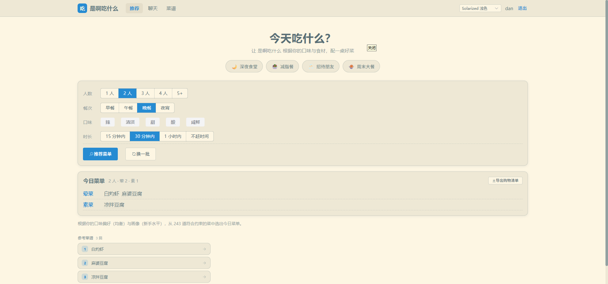

**聊天问答（SSE 流式 + 过程状态 + 菜名链接）**

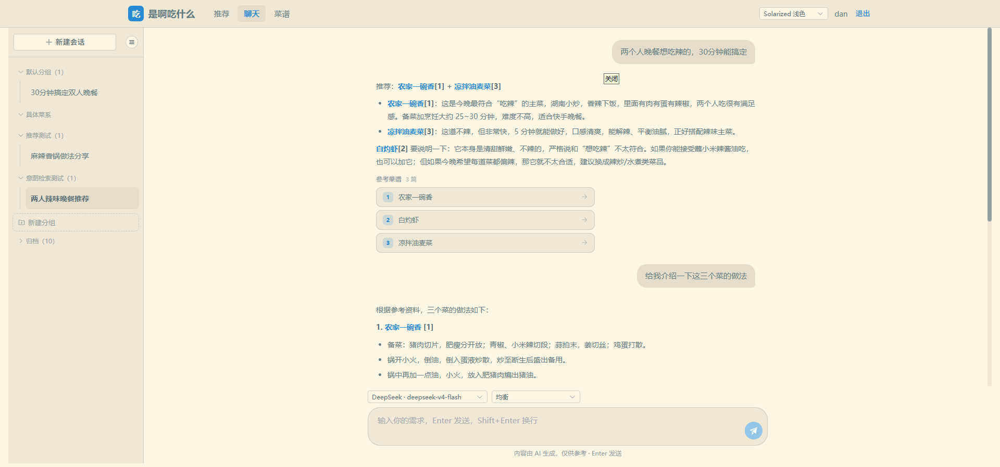

**菜谱浏览（分类/筛选/搜索/分页卡片）**

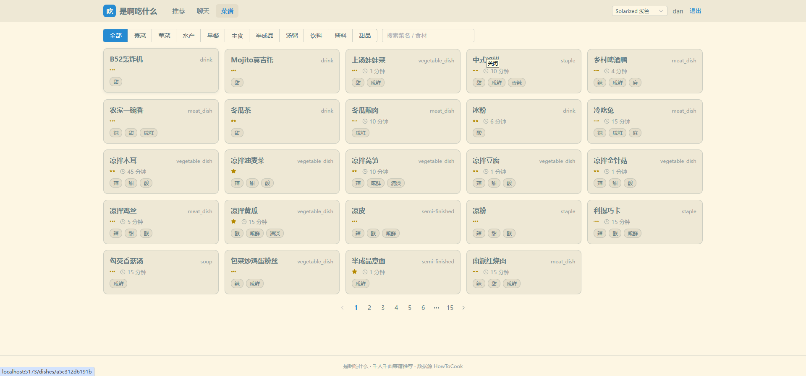

**菜谱详情（原料/分版本步骤/收藏/评分/相关菜）**

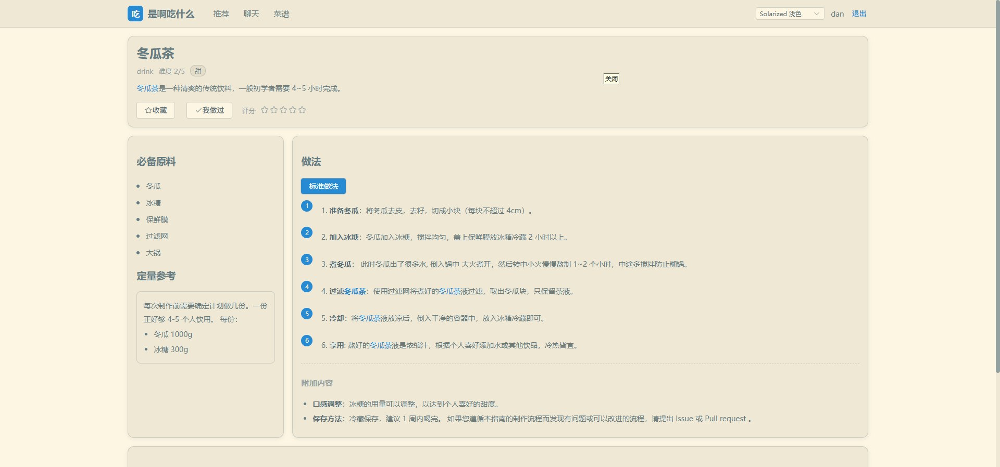

**个人中心（画像问卷 / AI 设置 / API 用量 / 我的收藏 / 行为历史 / 历史会话）**

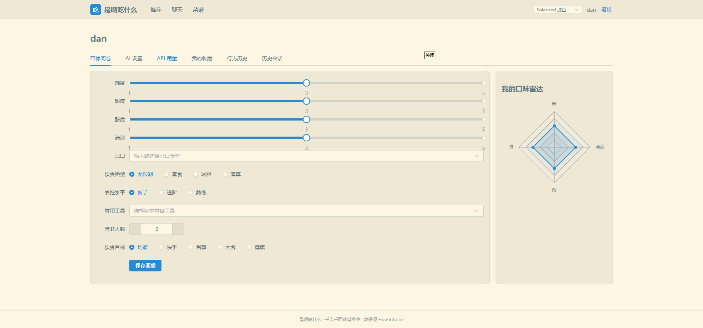

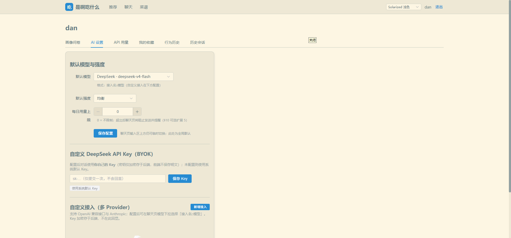

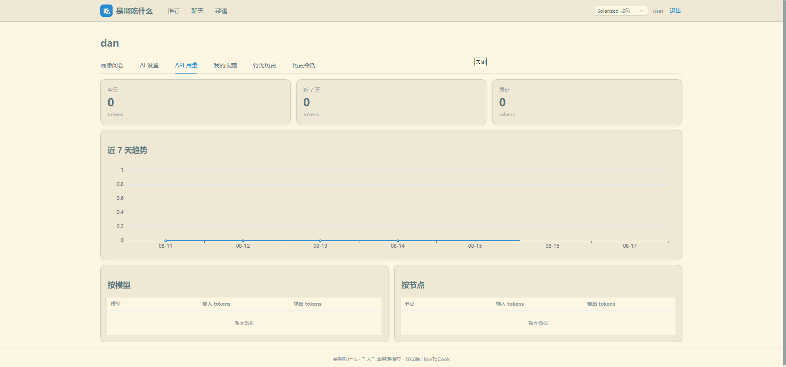

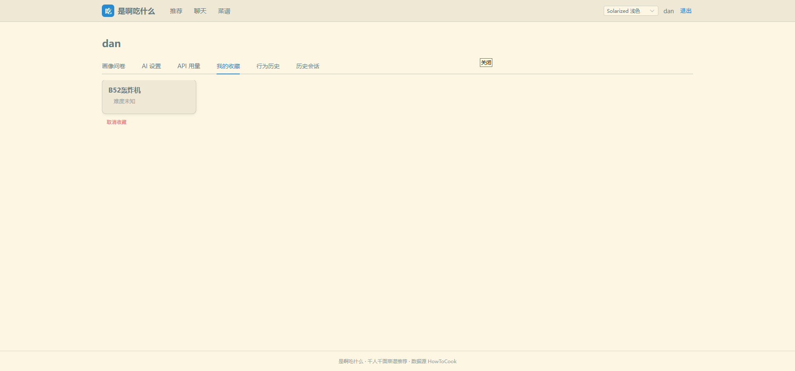

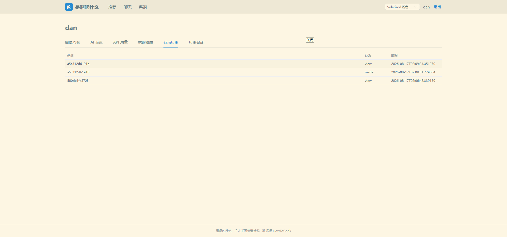

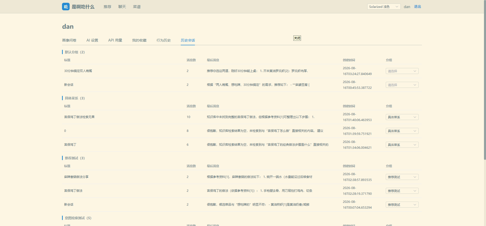

## 🧱 技术栈

| 端    | 技术                                                                                                                                                                                     |
|-------|------------------------------------------------------------------------------------------------------------------------------------------------------------------------------------------|
| 后端  | FastAPI + Pydantic v2 + SQLModel(SQLite, WAL) + alembic                                                                                                                                  |
| Agent | LangChain + LangGraph（分层 State，Mermaid 流程见设计文档）                                                                                                                              |
| 模型  | DeepSeek `deepseek-v4-flash`（默认，OpenAI 兼容，可 BYOK）+ 用户自定义接入（OpenAI 兼容 / Anthropic）；Embedding / Reranker 本地 `sentence-transformers`（CUDA 自动/CPU 兜底）           |
| 存储  | **可替换**：关系型 SQLite（默认，可换 PostgreSQL）+ 向量 Qdrant（默认，可换 Milvus）+ 图 Neo4j（默认，可换 **Kùzu** 嵌入式——原生 Python API、Cypher 兼容）——统一接口 + 工厂切换（§12.0） |
| 前端  | Vue 3 + Vite + TypeScript + Vue Router + Pinia + Element Plus + ECharts（按需）                                                                                                          |
| 主题  | 5 套（Solarized 浅/深、GitHub 浅/深、Nord），CSS 变量 + Element Plus 变量统一                                                                                                            |
| 部署  | docker compose 一键启动（`doc/docker/docker-compose.yml`，Compose v2.20+）+ 跨平台 Python 部署脚本                                                                                       |

> 完整设计见 [`doc/design/design.md`](doc/design/design.md)（数据建模 / 检索融合算法 / 千人千面 / 流式协议 / 部署 / 评测，16
> 章，决策点已全部确认 ✅）。

## 🚀 快速开始

### 前置要求

- Python 3.12（conda 推荐）
- Node.js 20+（前端开发）
- Docker + Docker Compose v2.20+（Neo4j / Qdrant）

### 1. 起中间件（Neo4j + Qdrant）

```bash
docker compose -f doc/docker/neo4j/docker-compose.yml up -d
docker compose -f doc/docker/qdrant/docker-compose.yml up -d
```

### 2. 后端（conda）

```bash
conda create -n yeahwhat2eat python=3.12 -y
conda activate yeahwhat2eat
cd backend
pip install -r requirements.txt
cp .env.example .env        # 填入 DEEPSEEK_API_KEY，按需修改 NEO4J_PASSWORD 等
uvicorn app.main:app --reload --port 8000
```

### 3. 装载数据（ETL，一次性）

```bash
# 首次启动后触发（需 admin 角色 token）：
curl -X POST http://localhost:8000/api/v1/admin/ingest
# 或运行管道脚本：
python -m app.pipeline.runner
# 秒级增量：仅补 dish_meta 的完整内容与图片字段（表结构升级后使用，不打标不重建向量）：
python -m app.pipeline.runner --sqlite-only
```

### 4. 前端

```bash
cd frontend
npm install
cp .env.example .env
npm run dev                 # http://localhost:5173（/api 自动代理到 8000）
```

## 🐳 一键部署

**推荐方式（一条命令，跨平台脚本：Windows/Linux/macOS 均可，仅需 Python 3.8+ 与 docker CLI）**：

```bash
# ① 部署 Lite 模式（SQLite + Kùzu + Qdrant 文件嵌入，零外部依赖）
python doc/docker/deploy.py lite
#    首次运行自动生成 doc/docker/.env，编辑填入 DEEPSEEK_API_KEY 后重新执行即可
#    重复部署自动复用 .env + Docker 层缓存，秒级完成

# ② 部署企业级模式（PostgreSQL + Milvus + Neo4j 每库一个容器 + 前后端）
python doc/docker/deploy.py enterprise

# 常用管理
python doc/docker/deploy.py status    # 查看运行状态
python doc/docker/deploy.py down      # 停止（两种模式）
# 访问 http://localhost:8080（端口在 doc/docker/.env 的 FRONTEND_PORT 自定义）
```

**高级/手动方式**（熟悉 docker 时使用；需自行保证 .env 生效）：

```bash
cp doc/docker/.env.example doc/docker/.env   # 填 DEEPSEEK_API_KEY 等
docker compose --env-file doc/docker/.env -f doc/docker/lite/docker-compose.yml up -d --build
docker compose --env-file doc/docker/.env -f doc/docker/docker-compose.yml up -d --build   # 企业级
# 测试联调可叠加 dev override（复用本机 backend/data，仅限本地测试）：
#   docker compose -f doc/docker/lite/docker-compose.yml -f doc/docker/lite/docker-compose.dev.yml up -d --build
```

**发布打包 / 离线部署**（镜像 = Python 的"jar 包"，构建一次到处运行）：

```bash
python doc/docker/build_release.py lite        # 构建 + docker save 导出 releases/yeahwhat2eat-lite-*.tar.gz
python doc/docker/build_release.py enterprise  # 企业级前后端镜像包
# 目标服务器（可完全离线，零依赖下载）：
scp releases/yeahwhat2eat-lite-*.tar.gz user@server:/opt/yeahwhat2eat/
ssh server 'cd /opt/yeahwhat2eat && python doc/docker/build_release.py load yeahwhat2eat-lite-*.tar.gz'
# 同一服务器重复部署（--build）：依赖层走 Docker 缓存（pip 层 CACHED），只复制代码层，不重复下载
```

**数据备份**（数据在 docker 卷中，备份 = 卷打包/导出）：

```bash
python doc/docker/backup.py lite          # Lite：打包 backend_data 卷（sqlite+kuzu+qdrant 文件）
python doc/docker/backup.py enterprise    # 企业级：pg_dump + neo4j/milvus 卷打包
```

**代理（可选，不写死端口）**：宿主机需代理时设置环境变量即透传（构建与运行均生效）：

```bash
HTTP_PROXY=http://127.0.0.1:7897 HTTPS_PROXY=http://127.0.0.1:7897 python doc/docker/deploy.py lite
```

## 📁 项目结构

```
YeahWhat2Eat/
├── README.md / AGENTS.md / LICENSE / .gitignore / .gitattributes
├── backend/                          # FastAPI 后端（分层，§11）
│   ├── app/
│   │   ├── main.py                   # 应用入口（lifespan 迁移 + 路由注册）
│   │   ├── api/                      # API 层：v1/{auth, users, dishes, chat, admin, health} + deps
│   │   ├── services/                 # 业务服务：dish / feedback / profile / auth / recommend ...
│   │   ├── db/                       # SQLModel 模型 + alembic 迁移（0001~0011）
│   │   ├── repositories/             # 数据访问层
│   │   ├── rag/                      # LangGraph Agent：nodes / prompts / state / rule_engine
│   │   ├── pipeline/                 # ETL 管道：runner / indexer / tagger
│   │   ├── core/                     # 配置 / 日志 / 异常 / 缓存
│   │   │   └── clients/              # 存储抽象：base / factory / qdrant / milvus / neo4j / kuzu / llm
│   │   └── schemas/                  # API DTO
│   ├── scripts/                      # 工具：init_data / diagnostics（数据与检索验收）
│   ├── tests/                        # 单测 / 集成 / RAG 评测（golden 集）
│   └── Dockerfile / requirements.txt / docker-entrypoint.sh / .env.example
├── frontend/                         # Vue3 前端（Vite + TS + Element Plus）
│   ├── src/
│   │   ├── views/                    # 页面：Home / Chat / DishList / DishDetail / Profile / Login / Register
│   │   ├── components/               # StreamChat / MdRender / DishCard / SourceCard / MenuCard ...
│   │   ├── api/                      # API 封装（http 拦截器 + 各模块 API）
│   │   ├── stores/                   # Pinia：user / theme / aiConfig
│   │   ├── router/                   # 路由（强制登录守卫）
│   │   └── styles/                   # tokens.css（5 套主题变量）
│   └── Dockerfile / nginx.conf / package.json / .env.example
├── doc/
│   ├── design/                       # 设计文档（design.md，16 章）+ 评测草稿
│   ├── docker/                       # 部署编排：lite/ 嵌入模式 + 企业级子 compose + deploy.py / build_release.py / backup.py
│   └── image/                        # README 界面截图
└── data/HowToCook-1.6.0/             # 菜谱数据源（只读，357 菜 + 18 tips，图片不入库）
```

## 📚 文档

| 文档                                           | 读者    | 内容                                 |
|------------------------------------------------|---------|--------------------------------------|
| [`doc/design/design.md`](doc/design/design.md) | 人 / AI | 完整系统设计（16 章，v0.18）         |
| [`AGENTS.md`](AGENTS.md)                       | AI 代理 | 开发入口指引：技术栈、命令、硬性约束 |

## 🚦 当前进度

**M1~M6 全部完成 ✅（0.1 定版）**

M1 数据管道 ✅ → M2 基础问答 ✅ → M3 推荐 Agent ✅ → M4 千人千面 ✅ → M5 前端 ✅ → **M6 部署 ✅（Lite
与企业级两种模式测试通过）**

> 最近新增：多模型接入（OpenAI 兼容/Anthropic + BYOK）、AI 用量统计与每日预算、会话分组（默认/自定义，拖拽移动 +
> 组内新建）、具体菜谱问答与推荐检索分流（意图 agent 判定 + 点名菜聚焦 + 指代解析）、回答正文菜名全量链接化（引用带菜名）、AI
> 过程状态指示、软删除单轮问答、会话滚动摘要记忆、 **存储可替换（SQLite/PostgreSQL + Qdrant/Milvus + Neo4j/Kùzu）**、
> **Lite/企业级双模式部署 + 镜像离线分发 + 数据隔离备份**、 **菜谱收藏状态初始化与收藏/取消即时反馈**、
> **详情页加载优化（相关菜不阻塞主内容）**、**对话偏好提取（聊天中说的"我不吃香菜/喜欢川菜"永久记住，§8.5）**。详见 [`doc/design/design.md`](doc/design/design.md)（v0.18）。

## 花费

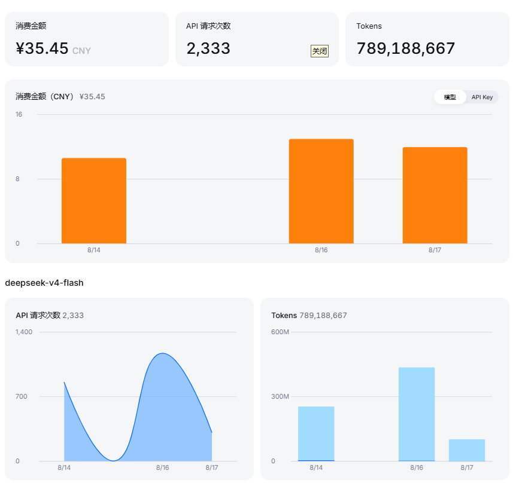
## ⚖️ 数据源与许可

  - **本项目代码**：[MIT License](LICENSE)（Copyright (c) 2026 dan chia）——允许商用/修改/分发，保留版权声明即可
- **菜谱数据**：[Anduin2017/HowToCook](https://github.com/Anduin2017/HowToCook) v1.6.0，采用 **The Unlicense**（公有领域
  Public Domain，见 `data/HowToCook-1.6.0/LICENSE`）——数据可自由使用，与本项目 MIT 许可无冲突
