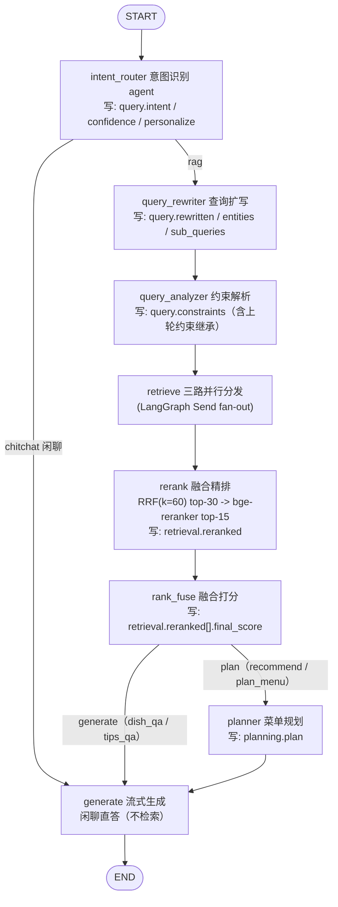

# 「今天吃什么」RAG Agent 系统设计文档

> 版本：v0.17（M1~M6 全部完成 + 0.1 定版打磨：收藏状态初始化与取消对称信号、详情页加载优化、跨平台 Python 部署脚本；本文件为设计与实现对照的权威依据）
> 技术栈：LangChain + LangGraph + DeepSeek API + FastAPI + Vue3；存储默认选型 Neo4j + Qdrant + SQLite（三库均可替换：Kùzu/Milvus/PostgreSQL，§12.0）
> 数据源：`data/HowToCook-1.6.0`（程序员做饭指南，社区菜谱仓库）

---

## 1. 项目目标

做一个"今天吃什么"的 RAG Agent：用户用自然语言提问（"两个人晚餐想吃辣的，30 分钟能搞定的"），系统结合菜谱知识库、用户个人画像，给出**千人千面**的推荐与菜谱解答，并支持追问（做法步骤、原料换算、禁忌提醒、购物清单等）。

核心能力：

1. **智能推荐**：按人数、餐次、口味、忌口、时间、工具、荤素搭配等约束，推荐"今日菜单"并说明理由。
2. **菜谱问答**：基于菜谱与厨房技巧知识库的 RAG 问答，回答带引用（哪道菜、哪个步骤）。
3. **千人千面**：显式画像（问卷）+ 隐式行为（浏览/收藏/评分/做过）+ 反馈闭环，让推荐因人而异、因时而异。
4. **实用工具**：原料定量换算（人数缩放）、购物清单生成、食材相克提醒、荤素搭配计算。

---

## 2. 数据源分析（HowToCook-1.6.0）

### 2.1 菜谱数据

`data/HowToCook-1.6.0/dishes/` 下共 **357 道菜谱**（358 个 md 文件含 1 个模板），按目录分为 10 类：

| 分类目录 | 类别 | 示例 |
|---|---|---|
| `vegetable_dish` | 素菜 | 西红柿炒鸡蛋、地三鲜 |
| `meat_dish` | 荤菜 | 宫保鸡丁、红烧肉、回锅肉 |
| `aquatic` | 水产 | 清蒸鲈鱼、油焖大虾、水煮鱼 |
| `breakfast` | 早餐 | 茶叶蛋、手抓饼、牛奶燕麦 |
| `staple` | 主食 | 蛋炒饭、热干面、扬州炒饭 |
| `semi-finished` | 半成品加工 | 速冻水饺、空气炸锅鸡翅中 |
| `soup` | 汤与粥 | 皮蛋瘦肉粥、玉米排骨汤 |
| `drink` | 饮料 | 酸梅汤、奶茶、杨枝甘露 |
| `condiment` | 酱料及其它材料 | 油泼辣子、糖醋汁、葱油 |
| `dessert` | 甜品 | 戚风蛋糕、提拉米苏 |

### 2.2 单篇菜谱的固定结构（模板约束，利于解析）

以 `dishes/template/示例菜/示例菜.md` 为规范，每篇菜谱包含：

| 章节 | 内容 | 解析价值 |
|---|---|---|
| `# 菜名的做法` | 标题 = 菜名 + 做法 | 菜名 |
| 正文首段 | 简介、特点、营养 | 语义向量、摘要 |
| `预估烹饪难度：★~★★★★★` | 1~5 星难度 | 过滤条件（匹配新手/熟练） |
| `## 必备原料和工具` | 必需原料 + 工具列表（`-` 列表） | 原料节点、工具节点 |
| `### 可选原料` | 可选原料 | 原料节点（optional 标记） |
| `## 计算` | 每份定量（原料 = 克数/个数） | 定量换算、购物清单 |
| `## 操作` | 步骤列表，**可能含多个版本**（简易版/进阶版） | 步骤节点、烹饪技法识别 |
| `## 附加内容` | 注意事项、安全提示 | 补充知识、安全提醒 |

> 注意点 ① 菜谱目录结构不统一（有的 `分类/菜名/菜名.md`，有的 `分类/菜名.md`），解析时以文件名作为菜名，路径第 1 级作为分类。
> 注意点 ② **同名菜冲突是真实数据问题**：如 soup 目录下存在两个"陈皮排骨汤"（`陈皮排骨汤/陈皮排骨汤.md` 与 `陈皮排骨汤.md`），因此 `dish_id` 一律用**相对路径 hash**（sha1 前 12 位），不用菜名；别名表（§6.4）负责同名归并展示。

### 2.3 技巧知识库（tips）

`tips/` 下共 **18 篇**：3 篇通用（厨房准备、如何选择现在吃什么、食材相克与禁忌）+ 11 篇入门学习（learn/：焯水、炒与煎、蒸、煮、腌、凉拌、去腥、微波炉、空气炸锅、高压力锅、食品安全）+ 4 篇进阶（advanced/：油温判断、糖色炒制、辅料技巧、专业术语）。

其中 `如何选择现在吃什么.md` 提供了可落地的**搭配规则**（将作为 Agent 的规则工具）：

- 菜的数量 = 人数 + 1
- 设素菜数 a、荤菜数 b：`a + b = N + 1` 且 `a ≤ b ≤ a+1` → `a = floor((N+1)/2)`，`b = ceil((N+1)/2)`
- 人数 > 8 时荤菜中增加鱼类；有小孩增加甜味菜
- 荤菜避免同一动物肉，优先序：猪肉 → 鸡肉 → 牛肉 → 羊肉 → 鸭肉 → 鱼肉

`食材相克与禁忌.md` 提供食材搭配禁忌（菠菜+豆腐等），可作为 **Ingredient 冲突关系**导入图数据库。

---

## 3. 总体架构

```
┌─────────────────────────────────────────────────────────────────────┐
│                          前端 Vue3 (frontend/)                       │
│  推荐页 · 聊天页 · 菜谱浏览 · 详情 · 个人中心 · 5 套主题可选          │
└──────────────────────────────┬──────────────────────────────────────┘
                               │ HTTP / SSE（流式）
┌──────────────────────────────▼──────────────────────────────────────┐
│                       后端 FastAPI (backend/)                        │
│  ┌──────────┐  ┌───────────────────────────────────────────────┐   │
│  │ REST API │  │          LangGraph Agent（编排核心）           │   │
│  │ 认证/CRUD│  │  意图路由 → 约束解析 → 并行检索 → 重排 → 融合   │   │
│  │ 用户/反馈│  │  → 菜单规划 → LLM生成(流式) → 记忆回写          │   │
│  └──────────┘  └───────┬──────────────┬──────────────┬─────────┘   │
│                        │              │              │             │
│  ┌─────────────────┐   │   ┌─────────┐│  ┌─────────┐ │             │
│  │ SQLite（业务真源）│   │   │ Neo4j   ││  │ Qdrant  │ │             │
│  │ 用户/画像/行为/   │◄──┘   │ 知识图谱 ││  │ 向量库   │ │             │
│  │ 会话/收藏/反馈    │       │ 菜谱/原料││  │ 菜谱/步骤│ │             │
│  └─────────────────┘       │ 关系网   ││  │ 向量     │ │             │
│                            └─────────┘│  └─────────┘ │             │
│                                       │  DeepSeek API          │             │
│                                       │  Embedding/Reranker    │             │
│                                       │  (SiliconFlow/本地)    │             │
│                                       └────────────────────────┘             │
└─────────────────────────────────────────────────────────────────────┘
```

**各存储的职责边界（关键设计决策）：**

| 存储 | 角色 | 内容 |
|---|---|---|
| **SQLite** | 业务数据唯一真源（Source of Truth） | 用户、画像、行为日志、收藏、反馈、聊天会话、菜谱元数据镜像、ETL 状态 |
| **Neo4j** | 知识图谱（关系推理） | 菜谱↔原料↔工具↔技法↔菜系↔口味、食材相克、同食材菜品关联、用户偏好镜像（供图查询） |
| **Qdrant** | 向量检索（语义召回） | 整菜文档向量（推荐召回）、步骤/技巧分块向量（问答召回）、用户口味向量（可选） |
| **DeepSeek API** | 大模型 | 意图理解、约束解析、工具调用、回答生成（`deepseek-v4-flash`）；embedding / reranker 由 `BAAI/bge-small-zh-v1.5` / `bge-reranker-v2-m3` 承担（§7） |

> 原则：Neo4j / Qdrant 里的图谱与向量**均可由关系型库中的元数据 + 原始 md 重建**（幂等 ETL）；关系型真源（默认 SQLite，企业级为 PostgreSQL）是唯一需要备份的业务数据。

---

## 4. 数据建模

### 4.1 Neo4j 图谱模型

```
(:Category {name})  ←[:BELONGS_TO]— (:Dish {id,name,path,difficulty,intro,time_est})
                                      │
              ┌───────────────────────┼──────────────────────────┐
              │                       │                          │
       [:REQUIRES]            [:USES] {optional}          [:HAS_STEP] {order,text}
              │                       │                          │
              ▼                       ▼                          ▼
   (:Ingredient {name})      (:Tool {name})              (:Step {dish_id,order,text})
              │
              ├──[:CONFLICTS_WITH]──► (:Ingredient)      ← 食材相克（来自禁忌文档）
              │
   (:Dish)─[:HAS_FLAVOR]─► (:FlavorTag {name: 辣/甜/酸/咸鲜/清淡/麻/香辣})
   (:Dish)─[:HAS_CUISINE]─► (:Cuisine {name: 川菜/粤菜/湘菜/家常/西式/日式/泰式/…})
   (:Dish)─[:HAS_TECHNIQUE]─► (:Technique {name: 炒/蒸/煮/炖/炸/煎/烤/凉拌/微波炉/空气炸锅})
   (:Dish)─[:RELATED_TO {reason: 同主料|同类|同菜系}]─► (:Dish)   ← 图扩散推荐
   (:Dish)─[:HAS_MEAL_TYPE]─► (:MealType {name: 早餐/午餐/晚餐/夜宵/加餐})

   —— 用户偏好镜像（供图查询，SQLite 为准）——
   (:User {id, profile_version})─[:LIKES {score}]─► (:Dish)
   (:User)─[:AVOIDS]─► (:Ingredient)
   (:User)─[:MADE {count, last_at}]─► (:Dish)
```

**图索引/约束**：`Dish(id)`、`Ingredient(name)`、`Tool(name)` 建唯一约束；`Dish.category`、`Ingredient.name` 建索引。

**语义标签生成**：菜系、口味、技法三类标签在 ETL 阶段由 DeepSeek（低成本 prompt，批量一次生成）打标，结果落 SQLite，再写入 Neo4j —— 避免运行时反复调用 LLM，且打标结果可审计、可重跑。

### 4.2 Qdrant 集合设计

| 集合 | 向量粒度 | payload | 用途 |
|---|---|---|---|
| `dishes` | 每菜 1 条：`菜名 + 简介 + 难度 + 原料列表 + 技法/菜系/口味标签 + 步骤摘要` | `{dish_id, name, category, difficulty, cuisines[], flavors[], techniques[], main_ingredients[], meal_type}` | 推荐主召回（语义 + 元数据过滤） |
| `chunks` | 按章节分块：`步骤块`（每步或每版本一块）、`原料块`、`附加内容块` | `{dish_id, dish_name, chunk_type, chunk_index, category}` | 菜谱问答（"鱼香肉丝怎么勾芡"） |
| `tips` | 每篇技巧 1~3 块 | `{tip_id, title, category}` | 技巧知识问答（"焯水要多久"） |
| `user_taste`（暂不启用） | 用户画像向量（由画像标签聚合生成） | `{user_id}` | 向量级"相似口味用户/菜品"召回；**先不建集合，M4 视画像效果再定** |

> 三个集合统一使用 `BAAI/bge-small-zh-v1.5`（**512 维**）生成向量，`cosine` 相似度 + `hnsw` 默认配置；在线检索阶段先召回 top-K（如 30），再用 `BAAI/bge-reranker-v2-m3` 交叉编码精排至 top（如 15）。

### 4.3 SQLite 表设计

```sql
users            (id, username, password_hash, role ENUM(user,admin), created_at)
refresh_tokens   (id, user_id, token_hash, expires_at, revoked, created_at)   -- 服务端存储，支持登出/吊销
user_profiles    (user_id PK, flavor_spicy 1-5, flavor_sweet 1-5, flavor_sour 1-5,
                  flavor_light 1-5, avoid_list JSON, diet_type, skill_level,
                  tools JSON, family_size, budget_level, goal, updated_at)
dish_meta        (dish_id PK, name, category, path, difficulty, intro, time_est,   -- dish_id=路径hash(§2.2)
                  main_ingredients JSON, tags JSON, content JSON,                    -- content=完整章节(§2.2，0004 迁移)
                  image TEXT, images JSON, vector_status, created_at)               -- 图片相对路径(§12.5 静态托管)
user_favorites   (user_id, dish_id, created_at, PK(user_id, dish_id))
user_feedback    (id, user_id, dish_id, action ENUM(like,dislike,rating,made,view),
                  rating 1-5 NULL, created_at)          -- 行为流水，可算一切指标
chat_sessions    (id, user_id, title, summary TEXT, created_at)   -- summary：超长会话滚动摘要
chat_messages    (id, session_id, role, content, sources JSON, created_at)
answer_cache     (cache_key PK, user_id, answer TEXT, sources JSON, plan JSON,
                  created_at, expires_at)               -- 问答缓存（§9.3）
llm_usage        (id, user_id, session_id, node, model, prompt_tokens, completion_tokens, created_at)
                                                       -- LLM 成本统计（§7），按日聚合报表
ingest_runs      (id, started_at, finished_at, dish_count, status, log, schema_version)
```

> 行为全部走 `user_feedback` 流水表（view/like/rating/made），画像更新由流水聚合出，天然支持时间衰减与回放重算。
> **表结构演进**：由 **alembic** 管理迁移（`app/db/migrations/`），首次建库 = `alembic upgrade head`，后端启动时自动执行未应用迁移；表结构变更一律新增迁移文件，禁止手改库。
> **并发与持久化**：SQLite 开启 **WAL 模式**（`journal_mode=WAL`）支持读写并发；写操作（行为流水、缓存、聊天记录、llm_usage）经单写者队列 / asyncio.Lock 串行化；单文件备份不受影响。

### 4.4 分片与容量策略（基于实际数据量）

**容量评估（按数据源实测统计）**：

| 数据 | 规模 | 对应存储 |
|---|---|---|
| 菜谱 | 357 道 | Qdrant `dishes` 357 条向量 |
| 步骤/分块 | 约 3,000~4,000 块（平均每菜 8~12 块） | Qdrant `chunks` |
| 技巧 | 18 篇 → 约 36~54 块 | Qdrant `tips` |
| 图节点 | 约 5,000~10,000（Dish/Ingredient/Tool/Step/标签 + 用户） | Neo4j 单实例 |
| 图关系 | 约 2 万~3 万（REQUIRES/HAS_STEP/USES/RELATED_TO/…） | Neo4j 单实例 |

**Qdrant 分片策略**：

1. **当前结论：单节点、单分片（`shard_number=1`、`replicas=1`）为最优** —— 总向量约 4,000 条（512 维 ≈ 8MB），Qdrant 官方建议"分片数 = 节点数"，无谓分片只会增加查询扇出开销；
2. **扩展路径（利用 ETL 幂等性，无需在线扩容）**：当向量量级增长到百万级或需要横向扩展时，**重建集合**并设 `shard_number = 2 × 节点数`（Qdrant 扩容标准做法）；`dishes` 集合可按需启用 **shard key**（按 `category` 分片，如早餐类查询只落早餐分片）；
3. **payload 索引**（过滤检索性能）：`dishes` 对 `category`(keyword)、`difficulty`(integer)、`meal_type`(keyword) 建索引；`chunks` 对 `dish_id`、`category` 建索引；`tips` 对 `category` 建索引；
4. **HNSW 参数**：`m=16`、`ef_construct=100`、检索 `ef=64`；当前规模无需量化，后续内存紧张再启用 int8 标量量化（精度损失 < 1%）；
5. **备份**：每日 Qdrant snapshot + ETL 重建脚本兜底（随时可从原始 md 全量重建）。

**Neo4j 分片/分区策略**：

1. **现状约束**：Neo4j **Community 版不支持分片**（Fabric 水平分片是 Enterprise 功能）→ 当前单实例，数据量（~1 万节点 / 3 万关系）远低于单机承载上限（亿级），**无需分片**；
2. **逻辑分区（单库内隔离）**：
   - **标签分区**：菜谱子图（Dish/Ingredient/Tool/Step/标签族）与用户偏好子图（User/LIKES/MADE/AVOIDS）同库共存，靠标签严格区分，Cypher 模板按域限定标签（§6.5 T1~T4），互不干扰；
   - **索引分区**：`Dish(id)`、`Ingredient(name)`、`Tool(name)` 唯一约束 + `Dish.category`、`Ingredient.name` 索引，所有查询索引定位，杜绝全库扫描；
3. **演进路径（用户量爆炸时）**：a) 升级 Enterprise 启用 Fabric，按用户 ID 哈希分片；b) 将用户偏好子图迁出到 SQLite（SQLite 本就是业务真源，Neo4j 用户图仅为查询镜像，迁移零风险），Neo4j 只保留菜谱主图；
4. **备份**：`neo4j-admin database dump` 每日快照 + ETL 重建脚本兜底。

---

## 5. 数据管道（ETL / Ingestion）

一次性脚本 + 可重复执行（幂等，`ingest_runs` 记录状态）：

```
Step 1  扫描 dishes/ 与 tips/ 目录，解析 md
        └─ 正则/结构化解析器（标题、简介、难度星级、必备/可选原料、计算章节、操作步骤、附加内容）
Step 2  打标（方案 B：规则优先 + LLM 只补难例，§5 低成本改造）
        └─ 规则全量：菜系/口味关键词推断（口味空给默认"咸鲜"）+ 技法关键词 + 分类→荤素 + 正则→时长
        └─ 难例筛选：菜系或口味为空（实测约 41% = 148 道）才送 DeepSeek，批次并行
        └─ 合并：LLM 字段优先、空字段回落规则；结果即时落盘 tags_backup.json（崩溃保护）
Step 3  写 SQLite：dish_meta + 标签 + 完整内容(content) + 图片(image/images)
Step 4  写 Neo4j：Dish/Ingredient/Tool/Step/Category/Flavor/Cuisine/Technique 节点与关系
        └─ Ingredient 冲突关系从 食材相克与禁忌.md 手工结构化映射表导入
        └─ reset 模式先清空菜谱子图再重灌（§3 可重建原则）
Step 5  写 Qdrant：生成 3 个集合的向量（embedding 批量；reset 模式删集合重建）
Step 6  校验与报告：菜谱数、向量数、孤立节点数、失败清单
Step 7  构建菜名/食材别名表（rag/data/alias_table.json，供 query_rewriter 兜底，§6.4）
```

**解析难点预案**：菜谱格式不统一（`### 可选原料` 缺失、操作含多个版本、部分菜谱无难度）→ 解析器按容错设计，缺失字段置 NULL，不阻塞入库；解析结果先落 SQLite 再驱动 Neo4j/Qdrant。

**重建窗口的在线降级**：ETL 重跑期间 Neo4j/Qdrant 处于半成品状态——`ingest_runs` 置 `running` 时，检索层读到"重建中"标记后**跳过图/向量检索，改用 SQLite dish_meta 直接过滤兜底**（规则召回全量可算），回答注明"知识库更新中"；重建完成置 `done` 后自动恢复。

**ingest 并发互斥**：触发新 ingest 前检查 `ingest_runs` 是否存在 `running` 记录，存在则直接返回 409 拒绝，防止两个管道互相污染。

**增量模式（秒级）**：`python -m app.pipeline.runner --sqlite-only` 仅更新 SQLite dish_meta 的 `content/image/images` 字段（§2.2 完整内容 + §12.5 图片扫描），跳过 LLM 打标 / Neo4j 图谱 / Qdrant 向量——用于表结构扩展后快速补齐数据，无需重打标签。

**打标崩溃保护（§5 断点续跑）**：Step2 打标完成后结果**即时落盘 `backend/data/tags_backup.json`**；`--skip-tag` 续跑时优先从备份恢复（缺失才回退 SQLite dish_meta）——后续步骤任何崩溃都不再丢失 LLM 标签。

---

## 6. LangGraph Agent 流程设计（核心）

### 6.1 状态设计（分层 State）

LangGraph 官方推荐的实践是**公共态与内部态分离**：`StateGraph(AgentState, input=InputState, output=OutputState)` —— 客户端只见入参/出参通道（SSE 流式只推送 OutputState），内部状态按职责拆成独立子状态，避免单一大 State 的 key 膨胀、字段互相污染、节点间隐式耦合。

```python
# ── 公共层：客户端可见 ─────────────────────────────────────────────
class InputState(BaseModel):
    query: str                      # 用户原始输入
    user_id: str | None = None      # 匿名可用
    session_id: str | None = None   # 多轮会话
    stream: bool = True             # 是否流式

class OutputState(BaseModel):
    status: Literal["running", "done", "error"] = "running"
    answer: str = ""                # 最终回答（流式增量写入）
    sources: list[SourceRef] = []   # 引用 [{dish_id, dish_name, chunk, path}]
    plan: MenuPlan | None = None    # 推荐模式：今日菜单
    events: list[AgentEvent] = []   # 过程事件（工具调用/检索命中），前端展示

# ── 上下文层：会话与画像（只读输入） ───────────────────────────────
class ContextState(BaseModel):
    profile: UserProfileSnapshot | None   # SQLite 聚合出的画像快照
    session_history: list[ChatTurn]       # 最近 N 轮对话
    now: datetime                         # 时段/季节/星期 → 场景化

# ── 理解层：意图与约束解析结果 ─────────────────────────────────────
class QueryState(BaseModel):
    intent: Intent            # recommend / dish_qa / tips_qa / plan_menu / chitchat / shopping_list
    confidence: float = 0.0   # 意图置信度（< 0.7 走默认 recommend 兜底）
    rewritten: str = ""       # 扩写后的检索查询（§6.4 query_rewriter 产出）
    constraints: DishConstraints   # 结构化：people / meal_time / max_time / flavors /
                                   # avoids / tools / skill_level / budget / use_ingredients
    entities: dict[str, list[str]] # 提及实体：食材名 / 菜名 / 技法名

# ── 检索层：三路召回 + 精排结果 ────────────────────────────────────
class RetrievalState(BaseModel):
    vector_hits: list[DishHit]        # Qdrant 语义召回
    graph_hits: list[DishHit]         # Neo4j 图谱召回
    rule_hits: list[DishHit]          # 规则过滤后候选
    chunk_hits: list[ChunkHit]        # 问答模式：步骤/技巧分块命中
    hard_filtered: list[FilteredOut]  # 硬过滤记录（忌口/时长/工具），保证可解释
    reranked: list[RerankedHit]       # reranker 精排结果（含 score）

# ── 规划层：菜单组合（仅推荐 / plan_menu 模式） ────────────────────
class PlanningState(BaseModel):
    ratio: MenuRatio | None           # 荤素公式结果（a 素 / b 荤）
    meat_candidates: list[str]        # 荤菜候选（已按动物多样约束）
    veg_candidates: list[str]
    plan: MenuPlan | None             # 最终菜单组合 {meat, veg, soup, reason}

# ── 记忆层：回写事件（行为流水 → 画像/图谱/向量） ─────────────────
class MemoryState(BaseModel):
    feedback_events: list[FeedbackEvent]  # 本次交互产生的行为（view/like/rating/made）
    profile_delta: dict[str, float]       # 画像增量（由聚合任务消费）
    graph_updates: list[str]              # 待写 Neo4j 的用户偏好变更
    qdrant_update: dict | None            # 用户口味向量更新（可选）

# ── 观测层：可观测性（不进业务逻辑） ───────────────────────────────
class TraceState(BaseModel):
    steps: Annotated[list[StepTrace], operator.add]   # 节点耗时/命中数/分数
    warnings: Annotated[list[str], operator.add]

# ── 内部总状态：仅图内部可见，不向客户端流式暴露 ──────────────────
class AgentState(TypedDict):
    input: InputState
    context: ContextState
    query: QueryState
    retrieval: RetrievalState
    planning: PlanningState
    memory: MemoryState
    output: OutputState
    trace: TraceState
```

**分层要点**：

1. **命名空间化**：子状态作为整体字段（`state["query"].constraints`），节点签名只声明自己需要的子状态类型（如 `def retrieve(state: RetrievalState) -> RetrievalState`），类型清晰、可独立单测，节点之间不直接 import 彼此的实现。
2. **Reducer 控制合并**：需要"追加"语义的列表字段用 `Annotated[list[T], operator.add]`（如 `trace.steps`、`output.events`），防止多节点并行写入时互相覆盖。
3. **流式安全**：`OutputState` 是唯一对外通道，SSE 事件直接映射 `events / answer / sources`；检索中间过程不出网，避免把内部噪音暴露给前端。
4. **Pydantic 校验**：子状态全部用 BaseModel，节点输出自动校验，非法数据 fail-fast，而不是带病跑到生成节点。
5. **克制拆分**：拆到"每个节点只接触自己需要的那一小块"为止，不追求无限细分（如 `PlannerState` 仅在需要时再细化），避免状态管理成本超过收益。

### 6.2 图结构（节点与边 · Mermaid）

> 下图由 **LangGraph `get_graph().draw_mermaid()` 从 `app/rag/graph.py` 实测导出**（v0.17），与代码一一对应；设计预留的独立 `ToolNode` 工具循环与 `memory_update` 记忆回写节点**尚未实现为图节点**——chitchat 直答与记忆注入在 `generate` 内部完成，行为流水经 chat API / 前端 feedback 落库（§8.2）。



**与 LangGraph 的对应关系**（节点 = `app/rag/nodes/` 一个文件，状态读写与 §6.1 分层 State 字段一一对应）：

| 图节点 | LangGraph 实现 | 读状态 | 写状态 |
|---|---|---|---|
| intent_router | `add_node` + `add_conditional_edges`（LLM agent 一次输出 intent/confidence/personalize，规则兜底） | `input.query`、`context.profile` | `query.intent`、`query.confidence`、`query.personalize`（§6.5 召回④） |
| query_rewriter | `add_node` | `query.intent` | `query.rewritten`、`query.entities`、`query.sub_queries` |
| query_analyzer | `add_node` | `query.rewritten`、`context.session_history` | `query.constraints` |
| retrieve | `add_node`，内部用 **`Send` API** 并行分发三路检索器 | `query.*`、`context.profile` | `retrieval.vector_hits`、`graph_hits`、`rule_hits` |
| rerank | `add_node`（内部两步：RRF 融合 k=60 → bge-reranker 精排 top-15；**预留拆分**为 fusion + rerank 两节点，§6.2 讨论） | `retrieval.*`、`query.rewritten` | `retrieval.reranked` |
| rank_fuse | `add_node` | `retrieval.reranked`、`context.profile` | `retrieval.reranked[].final_score` |
| planner | `add_node` + 条件边（仅推荐模式进入） | `retrieval.reranked` | `planning.ratio`、`meat_candidates`、`veg_candidates`、`plan` |
| generate | `add_node`（终节点；内部处理 chitchat 直答 prompt / summary 注入；工具调用为设计预留） | `planning.plan`、`retrieval.*`、`context.session_history` | `output.answer`、`output.sources`、`output.plan` |

**条件边与循环（对应 `add_conditional_edges`，与 `app/rag/graph.py` 一致）**：

1. `intent_router → generate | query_rewriter`：按 `query.intent` 分流——`chitchat` 直通 generate 直答（无独立 chitchat 节点），其余进检索链路；
2. `rank_fuse → planner | generate`：仅 `recommend / plan_menu` 进 planner，`dish_qa / tips_qa` 直通 generate；
3. **工具循环（§7.3 设计预留，未实现）**：`generate ⇄ ToolNode`、`planner ⇄ ToolNode` 回边尚未落代码——当前 generate 直接生成，购物清单经独立 API 导出（§9.4）；
4. **并行合并**：三路检索经 `Send` 并行执行，结果按 `Annotated[list, operator.add]` reducer 合并进 `RetrievalState`（§6.1），与 Mermaid 的 fan-out / join 一一对应；图定义集中在 `app/rag/graph.py`，条件边逻辑与节点实现分离，降低歧义。

**关键设计**：

1. **意图路由 + 查询扩写先行**：`intent_router` 基于"原文 + 画像"输出 `{intent, confidence}`（低置信度 < 0.7 走默认 recommend 兜底）；随后 `query_rewriter` 把口语扩写成检索语言并抽取实体（§6.4），推荐/问答/闲聊走不同子图，避免无谓检索，省 token、降延迟。
2. **检索三路并行 + 精排**（LangGraph 并行节点）：向量语义召回 + 图谱关系推理 + 规则硬过滤，三者互为补充；三路合并去重后进入 `rerank` 节点，用 `bge-reranker-v2-m3` 交叉编码精排（top-K 30 → 15），再交给融合打分。图查询用**预置 Cypher 模板 + 参数填充**，不由 LLM 自由写 Cypher（防幻觉、防注入）。
3. **工具调用循环（§7.3 设计预留）**：LangGraph 标准 `ToolNode` + 条件边为设计目标（注册工具：`calculate_menu_ratio(people)`、`scale_ingredients(dish_id, people)`、`get_dish_detail(dish_id)`、`check_conflicts(ingredient_a, ingredient_b)`、`build_shopping_list(dish_ids, people)`）；当前版本未实现为图节点——购物清单导出走独立 API（§9.4），生成直接输出。
4. **记忆回写**：每次交互结束，行为流水经 chat API / 前端 feedback 落 SQLite（§8.2，图内无 memory_update 节点）；画像聚合更新；Neo4j 用户偏好关系增量更新。多轮会话内（chat_sessions）携带对话历史进入 `generate`，实现追问（"第二步再说细一点"）。
5. **可观测**：`trace` 记录每节点耗时、检索命中、重排分数，前端/日志可查，便于调优。
6. **流式输出**：图以 `astream` 运行，节点事件与 LLM token 增量实时映射为 SSE 帧（协议见 §9.1）；事件顺序 `status → sources → tool → text → plan → done`，保证前端"先见候选卡片、再见正文"的体验，首字延迟（TTFT）为第一优化目标。
7. **多轮上下文管理**（已实现）：`session_history` 采用"**最近 10 轮全文 + 更早轮次滚动摘要**"策略——消息数超过 20 条后，每次对话结束后台任务把窗口外最旧消息 + 旧摘要压缩成新摘要（LLM，200 字内），存 `chat_sessions.summary`；加载时 `ContextState.summary` 随最近 10 轮全文一起注入 `generate`（生成）与 `query_analyzer`（早期约束继承）；不删除消息行（聊天历史展示完整）；摘要失败静默不影响主流程。

### 6.3 重排打分（千人千面核心公式）

```
final_score(d) =
    0.45 × relevance(d)          # reranker 交叉编码得分（与 RRF 排名归一化融合）
  + 0.25 × personal(d)           # 画像匹配：口味维度加权和 + 菜系偏好 + 难度匹配 + 工具匹配
  - 0.15 × recency_penalty(d)    # 近 7 天做过/强曝光 → 降权（时间衰减 exp(-Δt/7d)）
  + 0.15 × novelty(d)            # MMR：与已选候选的最大相似度惩罚 → 保证一餐多样化
```

- 硬过滤先行：忌口食材、禁忌搭配、超时长、超难度、工具不具备 → 直接剔除（不进打分）。
- 探索与利用：以 10% 概率从次优档位采样，保证"千人千面"不是"千人同面"的机械排序，也避免信息茧房。

### 6.4 查询扩写（Query Rewrite）与语义路由

**问题**：用户口语（"今晚俩人整个下饭的"）直接向量化/路由，召回与意图判断都不稳。因此在 `intent_router` 之后、`query_analyzer` 之前新增 **`query_rewriter` 节点**（chitchat 分支跳过）。

**扩写产物**（一次 LLM 调用，temperature=0.1，结构化输出 JSON）：

```json
{
  "rewritten_query": "今晚两人晚餐，想吃口味浓郁、咸香下饭的菜（30分钟内）",
  "entities": {
    "dish_names": [], "ingredients": ["鸡肉", "辣椒"],
    "techniques": ["炒"], "cuisines": ["川菜"],
    "meal_type": "晚餐", "people": 2, "max_time_min": 30
  },
  "sub_queries": ["两人晚餐 辣 下饭", "两人晚餐 汤"]
}
```

**扩写规则（写入 prompt 约束）**：

1. **口语 → 检索语言**："下饭" → "口味浓郁、咸香下饭"；"整点硬的" → "肉类硬菜"；"随便吃点" → "简单快手菜"；
2. **菜名/食材规范化**："西红柿炒蛋" → "西红柿炒鸡蛋"（命中菜名索引/别名表直接替换，LLM 兜底纠错）；
3. **隐式语境补全**："晚上" → 补 `meal_type=晚餐`；"招待朋友" → 补人数/菜数提示；"减肥" → 补 `diet_type=减脂`；
4. **复合需求拆分**：一条 query 含多个独立诉求（"宫保鸡丁怎么做？再推荐个素菜"）→ `sub_queries` 拆分为 问答 + 推荐 两路，各自走子图，答案合并输出；
5. **本地兜底（无 LLM / LLM 失败时）**：用**菜名索引 + 编辑距离（≤2）**做菜名/食材匹配、用正则提取人数/时间/忌口关键词，保证扩写链路不依赖模型可用性（与 §7.3 错误降级联动）。

**指代解析（§6.4 扩展 / 决策 16，已实现）**："这三个菜""它们""上面提到的"等指代 -> 从最近一轮助手消息提取具体菜名（`app/rag/utils.py` 的 dish_meta 全量菜名匹配，规则优先、LLM prompt 携带历史辅助），拼入 `rewritten_query`（保证向量检索命中）+ 回写 `QueryState.named_dishes`（generate 聚焦引用）——解决多轮追问（"介绍一下这三个菜的做法"）检索失败/引用无关菜的问题。

**语义路由改进**：

- `intent_router` 输入 = **原文 + 画像**，输出 `{intent, confidence}`；意图判定依据结构化实体（含菜名/食材 → dish_qa；含人数/时段 → recommend；两者都有 → 复合意图走 sub_queries 分路）；
- **置信度 < 0.7 走默认 recommend 分支**，并在回答中引导用户补充描述；
- 向量检索使用 `rewritten_query` 生成 embedding；图检索使用 `entities`；约束解析基于扩写文本 + 实体（与 §6.2 第 7 条约束继承合并）。

**sub_queries 执行与合并（复合意图）**：

1. **上限 3 路**：超出按优先级截断（推荐 > 问答 > 购物清单），防止子查询爆炸；
2. **并行执行**：各路 sub_query 经 `Send` API 并行跑独立子图（各自 扩写 → 检索 → 精排），互不阻塞；
3. **顺序合并**：`generate` 按 sub_queries **原始顺序**拼接各路产物为一段回答，每路的 `sources / plan` 独立追加进 `OutputState`，SSE 事件顺序保持不变（先完成的路先出 `sources` 帧，正文按固定顺序输出）；
4. 复合意图的 `plan` 帧合并为一份（多路推荐菜合并去重后按荤素分组）。

### 6.5 召回与融合算法细化（具体算法）

**一、三路召回**

1. **向量召回**（Qdrant，基于 `rewritten_query` 的 embedding）：
   - `dishes` 集合 cosine 相似度取 top-30，**得分过滤阈值 ≥ 0.35**（低于视为不相关，宁可少召回）；
   - 支持 payload 预过滤（category / difficulty / meal_type）缩小候选后再打分；
   - 问答模式同时查 `chunks`（top-10）、`tips`（top-5），按 chunk_type 分组供生成引用。

2. **图召回**（Neo4j，预置模板 + 参数填充，按命中维度计数加权）：

```cypher
// T1 同主料（模板权重 3）：与用户提到/常买的食材共享 ≥ 1 个主料
MATCH (d:Dish)-[:REQUIRES]->(i:Ingredient)
WHERE i.name IN $ingredients AND d.name <> $exclude
RETURN d.id AS dish_id, count(*) AS w ORDER BY w DESC LIMIT 20

// T2 同标签（模板权重 2）：菜系/技法/口味任一命中
MATCH (d:Dish)-[:HAS_CUISINE|HAS_TECHNIQUE|HAS_FLAVOR]->(t)
WHERE t.name IN $tags
RETURN d.id AS dish_id, count(DISTINCT t) AS w ORDER BY w DESC LIMIT 20

// T3 用户偏好扩散（模板权重 2）：收藏/做过菜的 RELATED_TO 一跳
MATCH (u:User {id:$user_id})-[:LIKES|MADE]->(seed:Dish)-[:RELATED_TO]->(d:Dish)
RETURN d.id AS dish_id, count(*) AS w ORDER BY w DESC LIMIT 20

// T4 相克/忌口检查（硬过滤辅助）：返回冲突组合供 rule_filter 剔除
MATCH (i1:Ingredient)-[:CONFLICTS_WITH]->(i2:Ingredient)
WHERE i1.name IN $ingredients RETURN i1.name, i2.name
```

   图召回产出 `(dish_id, weight)`，`weight = Σ 模板权重 × 命中数`。

3. **规则召回**（rule_filter）：全量 357 菜先过硬约束——忌口剔除、相克组合剔除、难度 ≤ 画像水平、时长 ≤ 预算、工具具备、荤素属性匹配、近 7 天做过剔除 → 候选集（通常 < 100 道），内部按行为热度排序兜底。

4. **场景分流（§16 决策 16）**：是否应用千人千面硬过滤由**意图 agent（intent_router，§6.4）一次 LLM 调用判定**，产出 `QueryState.personalize`，`rule_filter` 只消费标志不自行判定：
   - **LLM 主判**（`{intent, confidence, personalize}` 同次输出）：`personalize=true` = 开放式推荐请求（"今天吃什么"），千人千面硬过滤生效；`false` = 具体内容查询（点名具体菜/做法/技巧/闲聊），全量检索不拦截；LLM 理解复合语义——如"除了宫保鸡丁还有什么推荐的"判 `intent=recommend + personalize=true`（点名菜交检索实体，推荐仍按画像过滤），"宫保鸡丁怎么做"判 `dish_qa + false`；
   - **规则兜底**（LLM 失败/输出非法）：query 命中 dish_meta 全量菜名（最长匹配优先防子串误判）→ `false`（必召回）；否则 `recommend`/`plan_menu` → `true`，其余意图 → `false`；
   - **点名菜聚焦引用**：intent_router 同时检测 `query.named_dishes`（规则菜名匹配，确定性），`dish_qa` 时 `generate` 只引用点名菜的条目（截断放宽至 800 字符给完整做法），**不混入其他菜谱引用**；聚焦集为空（如抽取失败）回退全部；
   - 设计取舍：LLM 判语义（含别名/口语/复合意图），规则保底线（零成本确定性，防 LLM 误判导致指定菜被画像拦截）；「千人千面用于推荐，不拦截查询」。

**二、融合与精排**

1. **合并去重**：三路按 `dish_id` 合并，保留各自来源与分数；
2. **RRF 混合**（第一层排序）：`score_rrf(d) = Σ_src 1 / (60 + rank_src(d))`（k=60 为经典值），取 top-30 进入 reranker；
3. **reranker 精排**（第二层）：`bge-reranker-v2-m3` 对 (query, dish 文本) 交叉编码，输出 sigmoid 概率 `s_rerank ∈ (0,1)`；**输入拼接模板**为 `query + 标题 + 简介 + 难度 + 原料(前10) + 步骤摘要`，**单条截断 ≤ 512 token**（模型支持长文本，但截断保证精排延迟可控）；**输出契约**：`reranked` 为**扁平结构**（`text`/`name`/`dish_id` 等字段在顶层，无 `payload` 嵌套），`generate` 取文档文本时兼容扁平与历史 payload 两种结构（AGENTS.md 有回归提示）；**同菜多路命中合并时 text 选取：`dishes` 集合完整摘要优先于 `chunks` 步骤片段**（`source=="dishes"` 无条件覆盖），`difficulty` 仅非 None 时赋值（防 chunks 覆盖真值）；
4. **相关度合成**：`relevance(d) = 0.7 × s_rerank + 0.3 × norm(score_rrf)`，norm 为 min-max 归一化到 [0,1]；
5. **个性化最终分**（沿用 §6.3 结构，子项具体化）：

```
final_score(d) = 0.45 × relevance(d)
               + 0.25 × personal(d)
               - 0.15 × recency_penalty(d)
               + 0.15 × novelty(d)

personal(d) = Σ_k w_k × match_k(d) / Σ w_k
  match_口味  = 1 - |画像辣度 - 菜辣度| / 4        （w=0.40；甜/酸/清淡同法取均值）
  match_菜系  = 0.8 + 0.2 × 该菜系行为占比          （w=0.20）
  match_难度  = 画像水平匹配 ? 1 : 0.5              （w=0.15）
  match_工具  = 工具具备 ? 1 : 0                    （w=0.15）
  match_目标  = 快手目标且时长<20min ? 1 : 0.5      （w=0.10）
recency_penalty(d) = 做过 ? 1 - exp(-Δdays/7) : 0  （Δ = 距上次做过的天数）
novelty(d)        = MMR：score - 0.3 × max(cos(d, 已选菜))   （λ=0.7）
```

6. **硬过滤永远优先**：任何阶段候选违反忌口/相克/时长/难度/工具约束，直接剔除，不参与打分（**仅推荐场景**，具体问答跳过画像过滤，见召回④场景分流）；
7. **探索**：10% 概率从排名 6~15 档随机采样一道，避免千人同面。

**三、荤素规划算法（planner）**

1. 素菜 `a = floor((N+1)/2)` 道、荤菜 `b = ceil((N+1)/2)` 道（N = 人数）；
2. 荤菜轮选：按 final_score 从高到低选 b 道，**同一动物只选 1 道**（优先序：猪肉 → 鸡肉 → 牛肉 → 羊肉 → 鸭肉 → 鱼肉；N > 8 时补 1 道鱼类）；
3. 素菜轮选：final_score 排序，且与已选荤菜向量相似度 **< 0.8**（MMR 防一餐内重复）；
4. 需要汤/主食时：从 soup / staple 域补 1 道（final_score 最高且与主菜不重复）；
5. 输出 `plan {meat[], veg[], soup?, reason}`，reason 由 generate 节点组织成推荐话术。

---

## 7. 技术选型细节与决策点

**选型原则**：前端**能用官方就用官方**（Vue 官方生态、Element Plus 官方组件、浏览器原生能力）；官方确实缺失的场景（Markdown 渲染、图表、HTTP 客户端）才使用社区**最推荐且维护活跃**的库，并限定最小引入面，禁止为单一小功能引入重型依赖。后端依赖统一收敛在 `backend/requirements.txt`（§12.7），前后端技术分开管理。

### 7.1 后端技术栈

| 模块 | 选型（版本约束） | 用途 |
|---|---|---|
| 应用框架 | FastAPI ≥0.115 + uvicorn[standard] ≥0.30 | REST + SSE 流式（§9.1） |
| 数据校验 | Pydantic v2 ≥2.7（FastAPI 内置） | DTO / 分层 State 校验（§6.1） |
| 配置 | pydantic-settings ≥2.3 | .env 读取（§12.2） |
| ORM | SQLModel ≥0.0.22（SQLAlchemy 2.0） | SQLite 表模型（§4.3） |
| 迁移 | alembic ≥1.13 | 表结构演进 |
| 图数据库 | neo4j driver ≥5.20 | Neo4j 图谱（§4.1） |
| 向量库 | qdrant-client ≥1.9 | Qdrant 三集合（§4.2） |
| LLM 编排 | langchain ≥0.2 + langchain-openai ≥0.1 | DeepSeek 适配（OpenAI 兼容 base_url） |
| Agent 编排 | langgraph ≥0.2 | 状态图（§6） |
| 本地推理 | sentence-transformers ≥3.0 + torch ≥2.2（CPU 默认 / CUDA 可选） | embedding / reranker（§12.4） |
| 认证与安全 | PyJWT ≥2.8 + passlib[bcrypt] 1.7.4 + bcrypt 4.0.1 + slowapi ≥0.1.9 | JWT / 密码哈希（版本组合锁定，见 requirements）/ 接口限流 |
| 网络与工具 | httpx ≥0.27 + cachetools ≥5.3 + python-multipart ≥0.0.9 | LLM 传输 / 二级缓存 / 表单 |
| 测试与质量 | pytest + ruff + import-linter | 单测 / 规范 / 分层铁律（§11） |
| 运行时模型 | LLM=`deepseek-v4-flash`、Embedding=`BAAI/bge-small-zh-v1.5`（512 维）、Reranker=`BAAI/bge-reranker-v2-m3` | §16.1 已确认 ✅ |

### 7.2 前端技术栈

| 分类 | 选型（版本） | 类型 | 用途与理由 |
|---|---|---|---|
| 框架 | Vue 3.4+（组合式 API + `<script setup>`） | 官方 | 应用基础 |
| 构建 | Vite 5（create-vue 默认） | 官方 | 脚手架默认，零自定义 |
| 语言 | TypeScript 5 | 官方默认 | 类型安全 |
| 路由 | Vue Router 4 | 官方 | SPA 路由 |
| 状态 | Pinia 2 | 官方 | 用户态 / 主题 store |
| UI 组件 | **Element Plus 2.x + @element-plus/icons-vue** | 官方 | 按钮/表单/表格/弹窗/消息/分页等常规 UI 全覆盖；深色模式联动 Solarized 主题（§10.1） |
| 主题 | CSS 变量 + Element Plus dark 模式 | 官方机制 | 不引入第三方主题库 |
| SSE 流式 | `fetch` + `ReadableStream`（浏览器原生） | 浏览器原生 | 可带 JWT 头、可 Abort、逐帧解析（§9.1）；不用 EventSource |
| Markdown 渲染 | **markdown-it 14** + **DOMPurify 3** | 第三方（最推荐） | 官方缺失：SSE 增量渲染 + XSS 白名单清洗 |
| 图表 | **Apache ECharts 5** | 第三方（最推荐） | 官方缺失：口味雷达图等，业界标准，支持主题切换 |
| HTTP | **axios 1.x** | 第三方（事实标准） | 官方缺失：REST 请求 + JWT 拦截器统一注入 |
| 日期 | **dayjs 1.x** | 第三方（轻量标准） | 官方缺失：时间格式化（Element Plus 同款依赖，零额外成本） |
| 消息/追踪 ID | `crypto.randomUUID()`（浏览器原生） | 浏览器原生 | message_id / trace_id 生成，不引库 |
| 代码高亮 | markdown-it 插件（按需） | 第三方（可选） | 菜谱步骤中代码块高亮，M6 视需要引入 |
| 多语言 | vue-i18n（暂不启用） | 官方 | 后续迭代（低优先级） |

> 前端依赖面刻意保持最小：SSE、UUID、主题、localStorage 均用浏览器原生能力；仅"官方确实没有且社区公认最推荐"的场景（markdown-it、DOMPurify、ECharts、axios、dayjs）才引入第三方库，且版本固定可复现。

> 后端版本策略：上表为兼容范围示意，**实际安装以 `backend/requirements.txt` 精确锁定版本为准**（决策 9 ✅，§12.7）。

**成本控制**：菜谱打标为离线批量（一次成本）；运行时限制上下文（检索 top-k 压缩）；聊天记录按会话截断；回答引用只带摘要。

### 7.3 LLM 运行时参数与错误处理

| 参数 | 默认值 | 说明 |
|---|---|---|
| temperature | 结构化任务 0.1（意图/约束/工具）；生成 0.7 | 结构化输出低温保证 JSON 稳定 |
| max_tokens | 2048（回答）/ 512（工具 JSON） | 防止长尾输出拖慢流式 |
| timeout | 30s（chat）/ 60s（工具调用） | 连接超时 |
| retries | 2 次，指数退避（1s → 2s） | 网络抖动重试 |
| 并发上限 | 单进程 8 并发（semaphore） | 防止 API 限流击穿 |
| 工具循环上限 | 5 轮 | 防止 agent 死循环 |
| 单请求 token 预算 | 对话历史 8k + 检索上下文 6k + 生成 2k | 超预算按 §6.2 上下文管理裁剪 |

**错误码映射**：`401` 密钥失效 → 配置告警；`402` 余额不足 → `error` 帧"API 额度不足"；`429` 限流 → 退避重试 1 次后降级（跳过 LLM 用规则兜底生成）；`5xx` → 重试 2 次仍失败返回 `error {retryable: true}`；自定义接入解析失败（§10.2）→ 回退默认 DeepSeek 并记录警告。对应 .env 键见 §12.2。

---

## 8. 千人千面设计

### 8.1 画像维度（显式）

注册/设置页问卷：

| 维度 | 取值 | 用途 |
|---|---|---|
| 辣度 | 1~5 | 口味匹配 |
| 甜/酸/清淡偏好 | 1~5 | 口味匹配 |
| 忌口 | 香菜、内脏、海鲜、羊肉、芹菜…（多选+自定义） | **硬过滤** |
| 饮食类型 | 无限制 / 素食 / 减脂 / 清真 | 硬过滤 + 打分 |
| 烹饪水平 | 新手 / 进阶 / 熟练 | 难度过滤（新手 ≤ 3 星） |
| 常用工具 | 微波炉、空气炸锅、高压锅、烤箱、电饭煲… | 工具过滤 |
| 常驻人数 | 1/2/3/4+ | 荤素公式默认值 |
| 目标 | 快手 / 省事 / 大餐 / 健康 | 打分加权（快手→短时优先） |

### 8.2 隐式信号（行为学习）

浏览(view)、收藏(favorite)、👍/👎(like/dislike)、评分(rating)、做过(made)、追问（对话深度）。所有信号进 `user_feedback` 流水表，画像聚合任务定时/按需重算：

- 高频食材/菜系 → 上调对应口味维度与菜系权重
- `made` 计数 → 影响 recency_penalty 与"拿手菜"标记
- 主动 👎 的菜 → 该菜及其同主料菜降权
- **收藏/取消对称**：收藏接口内置 `like` 信号（`add_favorite`），取消收藏内置 `dislike` 信号（`remove_favorite`）——前端无需重复上报；行为权重 `like=3`、`dislike=-3`（§8.3）
- **view 上报**：详情页加载成功即上报 `view`（fire-and-forget，失败静默），保证热门榜与画像信号完整（前端已接入）

### 8.3 冷启动与变化

- 新用户：问卷兜底；未填问卷给**热门均衡推荐** + 引导填问卷。
  - 热门榜口径：`hot(d) = Σ_a action_weight(a) × exp(-Δt_a / 30d)`（a = 该菜的所有行为，Δt = 距今天数）
  - 行为权重：`view=1`、`favorite=3`、`rating=2×评分/5`、`made=5`；每日聚合一次，结果缓存 1h（§9.3 `hot_dishes`）
- 画像漂移：反馈流水支持任意时间窗重算（如按最近 30 天），趋势变化自然反映。
- 匿名用户：仅热门推荐 + 不写行为。

### 8.4 场景化千人千面

- **时间维度**：当前时段（早/午/晚/夜宵）→ 约束 meal_type；周末/工作日 → 时间预算不同。
- **一餐内多样**：荤素公式 + 肉类多样（不重复动物）+ 口味互补（一辣一清淡）+ MMR 去重。
- **多轮反馈**：上一轮"太辣了" → 后续轮次辣度权重下调（会话内即时生效）。

---

## 9. 后端 API 设计（FastAPI）

```
# 认证（JWT，见 §9.2）
POST   /api/v1/auth/register            # 注册（返回 access + refresh token）
POST   /api/v1/auth/login               # 登录
POST   /api/v1/auth/guest               # 游客会话（临时 token）
POST   /api/v1/auth/refresh             # 刷新令牌 {refresh_token} → 新 access + refresh
POST   /api/v1/auth/logout              # 登出（吊销 refresh token）
POST   /api/v1/auth/upgrade             # 游客转正：游客数据（行为/收藏/会话）合并进新账号

# Agent（核心，SSE 流式，协议见 §9.1）
POST   /api/v1/chat/stream              # 主入口：自然语言 → 流式回答
                                        # body: {message, message_id, session_id?, user_id?,
                                        #        model?, strength?, provider?, group?, persist?, diversity?}
                                        #   model=接入名::模型（§10.2，默认 deepseek::deepseek-v4-flash）
                                        #   strength=fast|balanced|deep（§9.1 模型/强度选择）
                                        #   provider=deepseek|自定义接入名（缺省按 model 前缀解析，§10.2）
                                        #   group=新建会话的分组（§16 决策 17，仅 session_id 为空时生效，null=默认分组）
                                        #   persist=false：一次性查询（首页推荐），不建会话不落库（§10）
                                        #   diversity=true：换一批，探索率提升同约束换新结果（§10）
                                        # 事件: SSE 帧（status/sources/tool/text/plan/done/error）
POST   /api/v1/recommend                # 快捷推荐（§10 首页，规则实现无 LLM）：{people, meal_time, flavors, max_time_min, want_soup?, diversity?} -> {plan, sources, reason}，毫秒级
GET    /api/v1/chat/sessions            # 历史会话列表（聊天界面左侧栏，含最后消息摘要；?archived 过滤归档；每条含 group 分组名，null=默认分组）
PATCH  /api/v1/chat/sessions/{id}       # 更新会话：{archived?} 归档/取消归档；{title?} 手动改名（改名后 title_auto=0，AI 不再覆盖）；{group?} 移动分组（§16 决策 17，null=默认分组）
POST   /api/v1/chat/sessions/{id}/fork  # 分叉会话：复制会话与历史消息为新会话（"更多"菜单，§10 聊天页）
GET    /api/v1/chat/sessions/{id}/export# 导出会话为 Markdown（"更多"菜单，§10 可选扩展 4）
GET    /api/v1/chat/sessions/{id}/messages  # 会话消息历史（归属校验）
DELETE /api/v1/chat/messages/{message_id}   # 删除单条消息（仅本人）
PATCH  /api/v1/chat/messages/{message_id}   # 软删除/恢复一组问答（§9 删除单轮问答）：{hidden:true|false}；user+assistant 成对，聊天界面隐藏、历史数据保留
DELETE /api/v1/chat/sessions/{session_id}   # 删除整个会话（仅本人）

# 用户与画像
GET    /api/v1/users/me                 # 我的信息
GET    /api/v1/users/me/profile         # 获取画像
PUT    /api/v1/users/me/profile         # 更新画像（问卷）
GET    /api/v1/users/me/feedback        # 行为流水（分页）
POST   /api/v1/users/me/feedback        # {dish_id, action, rating?}
GET    /api/v1/users/me/favorites       # 收藏列表
POST   /api/v1/users/me/favorites/{dish_id}
DELETE /api/v1/users/me/favorites/{dish_id}
GET    /api/v1/users/me/history         # 浏览/做过历史
GET    /api/v1/users/me/usage           # AI 用量统计（§10.2）：今日/近 7 天/累计 + 按日/按模型/按节点
GET    /api/v1/users/me/ai-key          # BYOK 查询（§10.2）：{has_custom_key}（Key 永不回显）
PUT    /api/v1/users/me/ai-key          # BYOK 保存：{api_key}（Fernet 加密存 users.deepseek_api_key_enc）
DELETE /api/v1/users/me/ai-key          # BYOK 清除（回退系统默认 Key）
GET    /api/v1/users/me/ai-providers    # 自定义接入列表（§10.2）：脱敏 {providers:[{name,provider_type,base_url,has_key,models}]}
PUT    /api/v1/users/me/ai-providers    # 保存接入：{providers:[{name,provider_type,base_url,api_key?,models[]}]}（api_key 空=保留原 Key）
DELETE /api/v1/users/me                 # 注销账号：删除画像/行为/会话/收藏数据（个保法）

# 菜谱浏览
GET    /api/v1/dishes                   # 列表（分类/难度/口味/搜索 过滤 + 分页）
GET    /api/v1/dishes/hot               # 热门菜谱（§8.3 热度公式聚合行为流水；冷启动入库序兜底）
GET    /api/v1/dishes/names             # 全量菜名映射 [{name, dish_id}]（§10 回答正文菜名链接化，357 条轻量无分页）
GET    /api/v1/dishes/{dish_id}         # 详情（完整内容：原料/可选/计算/分版本步骤/附加 + 成品图，与数据源 md 一致）
GET    /api/v1/dishes/{dish_id}/related # 相关菜（图扩散；图不可用降级同分类）

# 静态资源（菜谱成品图，§12.5）
GET    /static/dishes/{相对路径}         # 数据源 dishes 目录只读挂载（main.py StaticFiles；生产 nginx 反代）

# 知识库
GET    /api/v1/tips?category=           # 技巧文章列表
GET    /api/v1/ingredients?name=        # 原料查询（含相克关系）

# 管理（需 admin 角色，见 §9.2 / §12.6）
POST   /api/v1/admin/ingest             # 触发 ETL 管道（admin；运行中互斥，409）
GET    /api/v1/admin/ingest/{run_id}    # 管道状态（admin）
GET    /api/v1/health                   # 各存储健康检查（公开）
```

### 9.1 SSE 流式协议（AI 回答全部流式）

所有涉及 LLM 生成的接口（`/chat/stream` 聊天、`/recommend?stream=true` 推荐）一律走 SSE 流式，前端逐帧渲染，**首字延迟（TTFT）为第一优化目标**。

```text
请求  POST /api/v1/chat/stream
      Content-Type: application/json
      {"message": "两个人晚餐想吃辣的，30分钟能搞定", "message_id": "m-xxx", "session_id": "s-xxx", "user_id": "u-xxx",
       "model": "deepseek::deepseek-v4-flash", "strength": "balanced", "provider": "deepseek"}
      # provider 缺省时按 model 前缀解析（§10.2）；自定义接入名不在用户配置中则回退默认 DeepSeek（前端下拉已过滤）

响应  HTTP/1.1 200 OK
      Content-Type: text/event-stream
      Cache-Control: no-cache
      Connection: keep-alive
      X-Accel-Buffering: no          # 防止 nginx 等中间层缓冲 SSE

帧格式（每帧两行，空行结尾）:
event: <type>
data: <json>

事件类型与顺序:
event: status   {"trace_id":"…","stage":"intent|analyze|retrieve|rerank|plan|generate"}    # 阶段推进（首帧携带 trace_id）；前端渲染 Claude 式状态指示条（理解需求/检索/精排/生成）
event: sources  {"items": [{"dish_id","name","category","score","ref"}]}   # 候选命中：正文生成前先渲染卡片（通用引用——问答=检索命中；推荐=今日菜单中的菜；plan 为空=检索候选）
event: tool     {"name": "scale_ingredients", "args": {...}, "summary": "…"} # 工具调用过程展示
event: text     {"delta": "…"}                                               # LLM 生成增量（Markdown 片段；正文 [n] 引用由前端替换为菜名链接）
event: plan     {"meat": [...], "veg": [...], "ratio": {...}}                # 推荐模式的菜单结构化结果
event: done     {"trace_id","session_id","message_id","sources":[...],"usage":{...},"message_ids":{"user","assistant"},"duration_ms"}
                # message_ids：本轮问答的数据库 id（§9 软删除入口，前端删除本组问答用）
event: error    {"code": "LLM_TIMEOUT|RATE_LIMIT|RETRIEVAL_FAILED|...", "message": "…", "retryable": true}
```

**实现要点**：

1. **LangGraph 流式对接**：图以 `astream` 运行——节点级事件（`stream_mode="updates"`）映射为 `status / sources / tool / plan` 帧；`generate` 节点的 LLM token 增量（`stream_mode="messages"` 或 `astream_events` 的 `on_llm_stream`）映射为 `text` 帧；与 §6.1 的 `OutputState.events / answer` 增量通道一一对应，前端无需感知内部状态。
2. **中断与取消**：前端 `AbortController` 中止请求；服务端捕获后取消当前图执行（asyncio task cancel），已产生的行为流水不丢。
3. **断线与心跳**：服务端每 15s 发送空注释行 `: ping` 保活；前端用 `fetch + ReadableStream` 解析（不用 EventSource，因为需携带 JWT 请求头）；断线策略：**自动重试 1 次（3s 退避，复用同一 `message_id`）**，仍失败则标记"回答不完整"并显示手动重试按钮；未收到 `done` 帧一律视为不完整。
4. **错误语义**：LLM 超时/限流不中断整段对话，`error` 帧带 `retryable` 标记；检索阶段失败可降级（跳过检索直接生成，并注明"未引用知识库"）。
5. **渲染**：`text` 增量按 Markdown 流式渲染（markdown-it，代码块/列表渐进显示）；`sources` 卡片先于正文出现，点击跳转菜谱详情。
6. **链路追踪**：请求入口生成 `trace_id`（uuid），贯穿 SSE 首帧与 done 帧、LangGraph trace、后端日志行；前端报障时可凭 trace_id 精确检索该次请求的全部节点耗时。
7. **幂等重放**：前端重试携带同一 `message_id`（客户端生成），服务端写入行为流水/聊天记录前按 message_id 查重，断线重连不产生重复记录。
8. **并发控制**：同一用户同时最多 **2 个流式请求**（chat_service per-user 信号量），超出返回 429（`CODE=CONCURRENCY_LIMIT`）；同一会话内消息串行——上一条未完成时新请求排队等待，保证多轮上下文顺序正确。

### 9.2 认证与令牌（JWT）设计

- **Access Token**：HS256，有效期 **2h**，携带 `user_id / role / token_version`，无状态校验（JWT 签名验签）；
- **Refresh Token**：有效期 **7d**，**服务端存储**（`refresh_tokens` 表，存哈希），支持吊销；前端在 access 过期前静默续期（`/auth/refresh`）；
- **登出**：删除服务端 refresh token 即完成吊销（无需引入黑名单表）；
- **游客转正（upgrade）**：游客产生的行为流水、收藏、会话在注册时按 `user_id` 合并进新账号（`user_feedback` / `user_favorites` / `chat_sessions` 做 user_id 迁移），体验不丢失；
- **令牌失效联动**：用户修改密码/被管理员禁用时递增 `token_version`，旧 access 立即失效；
- **存储建议**：前端 access 放内存（不落 localStorage 防 XSS 窃取），refresh 放 localStorage 用于刷新；刷新接口 401 时强制重新登录。

### 9.3 缓存设计

**不引入 Redis**：进程内 LRU + SQLite 持久化，保持"业务真源唯一"（SQLite）的原则：

| 缓存 | key | TTL | 存储 | 说明 |
|---|---|---|---|---|
| 热门菜榜 | `hot_dishes` | 1h | SQLite + 内存二级 | 全局热度聚合结果，多进程共享 |
| 菜谱详情/相关菜 | `dish:{id}` / `related:{id}` | 24h | SQLite + 内存二级 | 静态数据，变化频率极低 |
| 检索结果 | `retrieve:{hash(query+约束+画像指纹)}` | 10min | SQLite + 内存二级 | 相同问法秒回，跳过三路检索 |
| 回答缓存 | `answer:{hash(user_id+约束+query)}` | 30min | SQLite `answer_cache` | 命中后直接回放 SSE（answer + sources + plan） |
| Embedding | 文本 → 向量 | 永久 | Qdrant payload | ETL 已持久化，运行时只查不重算 |

**失效与新鲜度**：

1. 用户产生反馈（👎 / 收藏 / 做过 / 评分）后，**立即清除该用户相关缓存条目**（feedback 写路径触发）；
2. "换一批"：前端请求带 `refresh=1` 参数绕过回答缓存，保证新鲜感；
3. 容量：**缓存统一落 SQLite 缓存表（多进程共享、不随 worker 漂移）**，进程内 LRU（cachetools，上限 2000 条）仅作热路径二级加速；SQLite 缓存表按 TTL 每日清理过期行；
4. 缓存开关与 TTL 由 `.env` 控制（`CACHE_ENABLED` / `CACHE_ANSWER_TTL`），压测时可关闭对比效果。
5. **缓存命中仍记行为**：回答缓存回放时照常记录 `view` 行为（message_id 幂等去重），保证热度统计与千人千面信号不因缓存而失真。

### 9.4 购物清单导出（文件导出 · 决策 6 ✅）

- **接口**：`POST /api/v1/shopping-list/export`，body `{dish_ids: [...], people: 2}`，返回 `text/markdown` 附件（`Content-Disposition: attachment; filename="shopping-list-YYYYMMDD.md"`），前端 `fetch blob` 触发下载；
- **生成逻辑**：调用 `build_shopping_list(dish_ids, people)` 工具（§6.2）→ 按 Ingredient 聚合去重（同食材合并、可选原料标注"（可选）"）→ 按 `scale_ingredients` 做人数换算 → 输出 Markdown：

```markdown
# 今日购物清单（2 人份 · 2025-01-01）
## 蔬菜 / 豆制品
- 土豆 ×2（约 480g）
- 莴笋 1 根（约 250g）（可选）
## 肉类 / 水产
- 手枪腿 1 支（约 350g）
## 调料 / 其它
- 生抽酱油 10g
...
## 涉及菜谱
- 宫保鸡丁（1 份）· 鱼香肉丝（1 份）
```

- **前端联动**：`plan` 帧渲染的菜单卡片带"导出购物清单"按钮，携带 dish_ids 调本接口；登录/游客均可导出；
- **限流**：按写接口限流（30 次/分钟）。

### 9.5 统一响应与错误码规范

- **JSON 接口**：成功 `{code: 0, message: "ok", data: {...}}`；失败 `{code: <非0>, message: "可读信息"}`；列表数据 `data: {items: [...], total, page, page_size}`；
- **文件流接口**（`/shopping-list/export`、`/static/` 图片等）返回原始字节流，不套 JSON 壳；
- **错误码段**：`400` 参数校验失败（Pydantic 统一转换） / `401` 未认证或 token 过期 / `403` 无权限（非 admin 访问 admin 接口） / `404` 资源不存在 / `409` 冲突（ingest 运行中） / `429` 限流或配额 / `500` 内部错误（SSE 场景走 `error` 帧）；
- 所有错误响应带 `trace_id`，便于与日志关联。

---

## 10. 前端设计（Vue3）

**应用展示名**：默认 **"是啊吃什么"**，由构建期环境变量 `VITE_APP_NAME` 注入（`frontend/.env` 配置，§12.2），用于浏览器标题（`<title>`）、页面 Header / 徽标、欢迎语；修改展示名只需改 env 值，无需改代码（开发环境直接生效，生产构建经 Dockerfile ARG 传入，§12.3/§12.4）。

**页面**：

| 页面 | 路由 | 核心内容 |
|---|---|---|
| 推荐首页 | `/` | Hero 场景快捷入口（深夜食堂/减脂餐/招待朋友等）+ 人性化标签选项（人数/餐次/口味/时长）+ **规则推荐（§10：无 LLM、毫秒级——千人千面规则打分 + 荤素规划）+ 菜单卡片 + 推荐理由 + 参考菜谱** + 换一批（探索采样）+ **未推荐时"大家喜欢"热门菜谱流** + 导出购物清单 |
| 聊天页 | `/chat` | **Claude/ChatGPT WebUI 布局**：可折叠历史会话栏（新建/切换 + 会话分组 + 归档，§16 决策 17）+ 居中消息流（限宽 768px，助手消息纵向排列：正文->菜单->参考菜谱）+ **过程状态指示条**（§9.1 status 帧：理解需求/检索/精排/生成，Claude 式）+ 工具调用过程 + 中断按钮 + 模型/强度选择（输入框上方，模型选项含自定义接入，§10.2）+ **菜名链接跳转详情（回答正文全量菜名链接化 + [n] 引用替换为菜名链接）** + 菜谱引用卡片（竖排列表式，编号角标与正文对应）+ **软删除单轮问答**（hover 删除按钮，聊天界面隐藏、历史保留，§9）+ 会话"更多"菜单（重命名/分叉/导出 Markdown/归档，当前会话同样可用，§10） |
| 菜谱浏览 | `/dishes` | 分类 Tab + 难度/口味/工具筛选 + 搜索 + 分页卡片 |
| 菜谱详情 | `/dishes/:id` | **成品图（封面+缩略图，/static 托管）+ 与数据源一致的完整内容**（必备/可选原料、计算定量、分版本步骤、附加内容）、收藏（进入即显示已收藏状态 `is_favorite`，点击收藏/取消即时变色）/做过/评分、相关菜推荐（不阻塞主内容，后台加载） |
| 个人中心 | `/profile` | 画像问卷编辑（口味雷达图）、**AI 设置（默认模型/强度/每日用量上限 + BYOK + 自定义多 Provider 管理，§10.2）**、API 用量统计（今日/近 7 天/累计 + 按日趋势 + 按模型/节点）、行为历史、收藏、历史会话（点击跳聊天页打开） |
| 登录注册 | `/login` `/register` | JWT 认证，支持游客模式与游客转正；**强制登录：除登录/注册外全部页面需登录**（游客也是登录态，未登录访问任意页面跳登录页并回跳，§10 千人千面前置） |

**组件**：`DishCard`（带成品图）、`MenuCard`（一餐多菜，菜名可点）、`StreamChat`（流式对话 + 过程状态指示 + 工具过程 + 中断 + 软删除单轮问答）、`MdRender`（markdown-it + DOMPurify + 全量菜名链接化 + [n] 引用带菜名 sourceMap）、`SourceCard`（参考菜谱竖排列表：编号角标 + 菜名单行省略 + hover 箭头跳转）、`FlavorTags`、`RatingStars`、`ProfileForm`、`ThemeToggle`（5 主题选择器）。

**布局规则（减少左右白边）**：`.page-container` 使用**百分比自适应**——常规页面 `max-width: min(76%, 1700px)`（左右各约 12%），屏幕 ≤1280px 时铺满；**聊天页走 `.page-wide` 全宽**（消息流内部再居中限宽 768px）；Header 与内容区同宽规则。

**技术要点**：Pinia 管理用户态与主题；`fetch` + `ReadableStream` 解析 SSE（带 JWT，支持 Abort 取消）；axios 拦截器带 JWT；Element Plus 组件库 + 5 套主题（§10.1）；回答 Markdown 用 **markdown-it 流式渲染 + DOMPurify 白名单清洗（防 XSS）**；响应式布局（移动端优先，程序员吃饭场景多在手机上）。

### 10.1 主题系统（5 套主流主题可选）

提供 **5 套主流主题**（§16 决策 13 扩展：多主题可选），所有组件（含 Element Plus）通过 CSS 变量统一风格，暗色主题挂 `html.dark` 联动：

| 主题 | 基调 | 主色 | 氛围 |
|---|---|---|---|
| Solarized 浅色 | base3 `#fdf6e3` | blue `#268bd2` | 经典低饱和，长时阅读 |
| Solarized 深色 | base03 `#002b36` | blue `#268bd2` | 经典暗色，护眼 |
| GitHub 浅色 | `#ffffff` | `#0969da` | 极简明亮，开发者熟悉 |
| GitHub 深色 | `#0d1117` | `#58a6ff` | 代码编辑器风暗色 |
| Nord 冷色 | `#eceff4` | `#5e81ac` | 北欧冷色，高级感 |

**实现方案**：

1. **Design Tokens**：`src/styles/tokens.css` 定义 `:root[data-theme='...']` 五组 CSS 变量（bg/text/accent 等 11 个 token + 圆角/阴影）；
2. **Element Plus 统一**：每个主题块同时覆盖 `--el-color-primary` 系（color-mix 生成 light-3/5/7/9、dark-2）与表面色（`--el-bg-color` / `--el-fill-color-blank` / `--el-text-color-*` / `--el-border-color`），保证组件库与自定义样式风格一致；暗色主题额外挂 `html.dark`；
3. **切换逻辑**：`useThemeStore` 管理 5 主题选择，持久化 `localStorage`（key `yeahwhat2eat-theme`）；入口 JS 防闪烁（FOUC）按暗色白名单注入；默认跟随系统偏好（深色 -> Solarized 深色）；
4. **图表跟随**：ECharts 监听 `theme-changed` 事件 `setOption` 更新配色；
5. **选择器**：Header 下拉（带主题色点预览）。

### 10.2 多 Provider 接入、BYOK 与 AI 用量（§16 决策 14/15 扩展）

**背景**：系统默认使用预配置的 DeepSeek（OpenAI 兼容，`DEEPSEEK_API_KEY` 运维 Key）；为满足用户自带 Key（BYOK）与多模型接入诉求，提供"默认 DeepSeek + 自定义接入"两级模型体系，**Key 一律只存后端、加密存储、永不回显**。

**模型标识**：统一使用 `接入名::模型` 格式（如 `deepseek::deepseek-v4-flash`、`硅基流动::Qwen/Qwen2.5-7B-Instruct`）；前端模型下拉 = DeepSeek 预置项（v4-flash / deepseek-chat）+ 全部自定义接入的模型列表；聊天页发送时拆出 `provider`（接入名）随 `/chat/stream` 下发，后端按请求级 contextvar 解析对应接入的 Key/BaseURL/类型（§9.1，避免并发串 Key）。

**接入类型与解析**（`core/clients/llm.py`）：

| provider_type | 适配器 | 说明 |
|---|---|---|
| openai（默认） | `ChatOpenAI`（langchain-openai） | 任意 OpenAI 兼容 `/v1/chat/completions` 服务（DeepSeek、硅基流动、Kimi 等）；base_url 需含版本路径（如 `https://api.deepseek.com` 或 `.../v1`） |
| anthropic | `ChatAnthropic`（langchain-anthropic） | Anthropic 官方 `/v1/messages` |

**Key 存储与安全**：

1. BYOK：`users.deepseek_api_key_enc`（Fernet 加密，密钥由 `JWT_SECRET` 派生）；请求级优先用用户 Key，未配置回退系统 Key；
2. 自定义接入：`users.ai_providers`（JSON 数组），每条含 `name / provider_type / base_url / api_key_enc / models[]`；`PUT /me/ai-providers` 提交 `api_key` 为空 = 保留原 Key（按 name 匹配），回显一律脱敏为 `has_key`；
3. 加密派生自 `JWT_SECRET`：修改 JWT_SECRET 会使已存 Key 无法解密（运维注意事项，§12.6）；
4. 密钥不进前端、不进日志（§12.6 日志脱敏）。

**AI 用量与预算**：

1. 每次 LLM 调用（含工具/标题自动摘要）记录 `usage_logs`（user_id/model/node/prompt/completion_tokens）；
2. `GET /users/me/usage` 聚合今日/近 7 天/累计 + 按日趋势 + 按模型/节点拆分（§9 API）；
3. 前端"AI 设置"可设**每日用量上限**（`dailyTokenLimit`，0=不限制），聊天页发送前检查今日已用，超限阻止发送并提醒（防刷成本）。

**会话管理（§9 API 扩展）**：会话标题**AI 仅首次命名一次**——提问即用消息前 20 字做默认标题，首轮完成后 AI 精炼总结一次覆盖（≤12 字）；此后 `title_auto=0` 锁定，**标题由用户手动管理**，AI 不再自动覆盖；"更多"菜单支持**重命名 / 分叉（fork）/ 导出 Markdown / 归档 / 移动到分组（拖拽）**（归档会话在左侧栏折叠分组，不参与自动标题）。

**会话分组（§16 决策 17，参考主流大模型 WebUI 会话文件夹）**：

1. 每个会话可归属**一个分组**（`chat_sessions.group` TEXT，NULL = **默认分组**，未手动分组的会话自然归入）；
2. 聊天页左侧栏按组展示：**默认分组**（未分组会话）+ 各自定义分组（组名可折叠，显示会话数），归档区独立保留；
3. 交互（**拖拽为主，无第三方依赖，原生 HTML5 DnD**）：
   - **拖拽移动**：会话项拖到分组头即移入该组（拖拽中目标组高亮虚线框；拖到默认分组 = 移回默认；**归档会话拖入分组 = 自动取消归档并归组**）；
   - **分组内新建**：每个分组头悬停显示"+"按钮 -> 新会话归属该分组（首条消息随 `/chat/stream` 请求携带 `group`，后端仅新建会话时生效）；
   - 侧边栏底部"新建分组"（弹窗命名，重名拒绝，当前会话归入新组）；分组为会话字段派生（无独立表），组内会话清空后分组自动消失；
   - "更多"菜单保留：重命名 / 分叉 / 导出 Markdown / 归档（移动分组已由拖拽取代）；
4. 个人中心"历史会话"同样按分组分组展示，并提供行内移动分组下拉，与聊天页一致。

---

## 11. 项目目录结构规划

```
YeahWhat2Eat/
├── doc/                            # 文档与部署编排
│   ├── design/                     #   设计文档（本文件 + golden_qa.draft.json 评测草稿）
│   └── docker/                     #   部署编排
│       ├── docker-compose.yml      #   ★ 一键部署入口（include 聚合全部组件）
│       ├── Backend/docker-compose.yml  #   后端服务（build ../backend，env 取自 ../backend/.env）
│       ├── Frontend/docker-compose.yml #   前端服务（build ../frontend，nginx 托管 + 反代）
│       ├── neo4j/docker-compose.yml    #   已有（一键部署时补充 healthcheck）
│       └── qdrant/docker-compose.yml   #   已有（一键部署时补充 healthcheck）
├── data/HowToCook-1.6.0/          # 菜谱数据源（只读）
├── backend/
│   ├── app/
│   │   ├── main.py                # 应用入口：创建 app、CORS、挂载路由、全局异常处理
│   │   ├── core/                  # 横切层：与业务无关，只被上层依赖
│   │   │   ├── config.py          #   pydantic-settings 读 .env（模型名/top-k/连接串）
│   │   │   ├── logging.py         #   日志配置（结构化）
│   │   │   ├── exceptions.py      #   统一异常体系 + FastAPI 异常处理器
│   │   │   └── clients/           #   外部服务客户端：只封装连接与调用，不含业务
│   │   │       ├── llm.py         #     DeepSeek chat（langchain-openai 适配）
│   │   │       ├── embedding.py   #     EmbeddingClient 抽象：sentence-transformers 本地实现（CUDA 自动/CPU）+ SiliconFlow 实现
│   │   │       ├── reranker.py    #     RerankerClient 抽象：sentence-transformers 本地实现（CUDA 自动/CPU）+ SiliconFlow 实现
│   │   │       ├── neo4j.py       #     Neo4j driver 封装
│   │   │       └── qdrant.py      #     Qdrant 客户端封装
│   │   ├── schemas/               # Pydantic DTO：请求/响应模型（与 ORM、Agent State 分离）
│   │   │   ├── auth.py  user.py  dish.py  chat.py  feedback.py
│   │   ├── api/                   # 路由层：参数校验、鉴权、响应组装，无业务逻辑
│   │   │   ├── deps.py            #   依赖注入：get_db / get_current_user / get_agent
│   │   │   └── v1/
│   │   │       ├── router.py      #   版本路由汇总注册
│   │   │       └── auth.py  chat.py  users.py  dishes.py  tips.py  admin.py
│   │   ├── db/                    # SQLite 数据访问层
│   │   │   ├── models.py          #   SQLModel/SQLAlchemy 表定义
│   │   │   ├── migrations/        #   alembic 迁移（首次建库与表结构演进）
│   │   │   ├── session.py         #   engine / session 生命周期
│   │   │   └── repositories/      #   仓储层：只暴露数据方法，不写业务逻辑
│   │   │       ├── user_repo.py  profile_repo.py  feedback_repo.py
│   │   │       └── chat_repo.py  dish_repo.py  ingest_repo.py
│   │   ├── services/              # 业务用例层：组合仓储 + 外部能力，可脱离 HTTP 单测
│   │   │   ├── auth_service.py    #   注册/登录/JWT
│   │   │   ├── profile_service.py #   画像读写、行为流水聚合重算
│   │   │   ├── personalization.py #   个性化打分、时间衰减、MMR、探索采样
│   │   │   ├── dish_service.py    #   菜谱浏览/详情/相关
│   │   │   └── chat_service.py    #   会话管理、调 Agent、SSE 流式转发
│   │   ├── rag/                   # RAG 领域层：只依赖 core.clients 与仓储只读接口
│   │   │   ├── graph.py           #   LangGraph 图构建与编译（组装节点，不含节点实现）
│   │   │   ├── state.py           #   分层 State 定义（§6.1）
│   │   │   ├── nodes/             #   一个节点一个文件，签名只声明所需子状态
│   │   │   │   ├── intent_router.py  query_rewriter.py  query_analyzer.py
│   │   │   │   ├── retrieve.py  rerank.py  rank_fuse.py  planner.py
│   │   │   │   └── generate.py  memory_update.py
│   │   │   ├── retrievers/        #   三路检索器：抽象接口 + 实现（可替换）
│   │   │   │   ├── base.py  vector_retriever.py  graph_retriever.py  rule_retriever.py
│   │   │   ├── tools/             #   Agent 工具（注册进 ToolNode）
│   │   │   │   └── ratio.py  scale.py  shopping_list.py  conflicts.py  dish_detail.py
│   │   │   ├── data/              #   菜名/食材别名表（query_rewriter 兜底，§6.4）
│   │   │   └── prompts/           #   Prompt 模板（与代码分离；文件头带 version 字段，评测报告绑定版本 §13）
│   │   ├── pipeline/              # 离线 ETL：独立于在线请求路径
│   │   │   └── parser.py  tagger.py  graph_builder.py  vector_indexer.py  runner.py
│   │   └── utils/                 # 少量通用工具（尽量薄）
│   ├── tests/
│   │   ├── eval/                  #   RAG 评测：golden_qa.json + 指标脚本（§13）
│   │   └── ...                    #   单元（节点/服务）+ 集成（三库连通）
│   ├── scripts/
│   │   ├── test_chat.py  test_personalization.py   # M4 验收脚本
│   │   └── diagnostics/           #   诊断工具（面向人的验收报告，可复用）
│   │       ├── check_data.py      #     数据完整性：图片覆盖/md链接残留/标签/content/ingest日志
│   │       ├── debug_retrieve.py  #     检索链路：向量命中 + rerank text 合并检查（§6.5）
│   │       └── build_graph.py     #     图构建冒烟 + 意图/场景判定用例（§6.2/决策 16）
│   ├── Dockerfile                 # 多阶段镜像（python:3.12-slim + uvicorn；本地推理见 §12.4）
│   ├── requirements.txt           # ★ 全部依赖单文件（含 torch + sentence-transformers；CUDA 安装指引见文件头注释 / §12.4），第三方 pip install -r 即可复用
│   ├── .dockerignore
│   └── .env.example               # ★ 配置模板：手动复制为 backend/.env（含密钥，不进版本库）
├── frontend/                      # Vue3 + Vite（create-vue 官方脚手架默认结构，便于第三方复用）
│   ├── src/
│   │   ├── api/  ├── stores/（用户态+主题）  ├── router/
│   │   ├── styles/（tokens.css：5 套主题变量 + Element Plus 覆盖）
│   │   ├── views/ ├── components/ ├── assets/ └── App.vue
│   ├── package.json
│   ├── vite.config.ts
│   ├── Dockerfile                 # 构建阶段 node:20 → 运行阶段 nginx:alpine
│   ├── nginx.conf                 # 托管 dist + 反代 /api → backend:8000（SSE 关缓冲）
│   ├── .dockerignore
│   └── .env.example               # ★ 配置模板：手动复制为 frontend/.env（VITE_API_BASE_URL）
└── .gitignore
```

**后端分层规范（依赖铁律）**：

1. **依赖单向向下**：`api → services → repositories + rag → core/clients`；`pipeline` 独立于在线路径；禁止反向依赖与循环导入（CI 用 import-linter 检查）。
2. **职责单一**：api 层不做业务判断；service 层不碰 HTTP/SSE 细节；repository 只翻译"数据操作"；`core/clients` 只封装连接与调用签名。
3. **依赖注入**：一切外部依赖通过 FastAPI `Depends` 注入（`get_agent` / `get_llm` / `get_db`），测试时全部可 mock，service 层与 rag 节点可脱离 HTTP 独立单测。
4. **三套模型互不混用**：`schemas`（API DTO）、`db/models`（ORM）、`rag/state`（Agent State）各自独立，层间转换统一在 service 层完成。
5. **rag 领域内部分层**：graph / state / nodes / retrievers / tools / prompts 六个包，节点之间只通过 State 通信，不直接 import 彼此实现。
6. **接口隔离**：`EmbeddingClient` / `RerankerClient` / Retriever 均为抽象接口，换模型、换存储实现只改 `core/clients` 或 `rag/retrievers`，业务层零改动。

---

## 12. 部署与 Docker 设计（一键部署）

### 12.0 存储可替换（§16 决策 18，接口抽象）

三存储均可插拔，**业务层零感知**（`app/core/clients/base.py` 定义接口，`factory.py` 按 provider 选择实现）：

| 类别 | 接口 | 默认实现 | 可替换实现 | 切换方式 |
|---|---|---|---|---|
| 关系型 | SQLAlchemy ORM（天然抽象） | SQLite（WAL） | **PostgreSQL** 等任意 SQLAlchemy 支持库 | `DATABASE_URL` 填 URL（如 `postgresql+psycopg2://...`，装 psycopg2-binary）；表结构走 alembic 迁移 |
| 向量库 | `VectorStoreClient` | `QdrantClient`（qdrant-client） | **`MilvusVectorStore`**（pymilvus） | `VECTOR_STORE_PROVIDER=milvus` + `MILVUS_URI` |
| 图库 | `GraphStoreClient` | `Neo4jClient`（neo4j driver） | **`KuzuGraphStore`**（**Kùzu 原生 Python API**，嵌入式零部署、Cypher 兼容，推荐单机；langchain-kuzu 0.4.2 依赖 langchain.chains 与 langchain 1.x 不兼容，勿用） | `GRAPH_STORE_PROVIDER=kuzu` + `KUZU_DB_PATH` |

**接入新数据库**（其他开发者）：继承 `VectorStoreClient` / `GraphStoreClient` 实现全部方法（search/upsert/ensure_collection/... 或 run/execute_write/...），在 `factory.py` 注册 provider 名，.env 切换即生效；Cypher/模板不动（图查询仍走预置模板，§6.5；Memgraph 因 Cypher 兼容零改动）。

**注意**：Milvus payload 过滤当前支持 `field == value` / `field in [...]` 两种 expr 映射（复杂过滤按需扩展）；向量库的 LangChain 集成（langchain-qdrant / langchain-milvus）为可选扩展位——因 langchain vectorstore 文本级 API 与原始点操作存在阻抗（add_texts 重复 embed），默认实现保留原生客户端（接口已抽象可换库）。

### 12.1 部署结构总览（§16 决策 19：两种部署模式）

**Lite 模式（`doc/docker/lite/`，单机/测试首选）**：SQLite + Kùzu + **Qdrant 文件嵌入**（`QDRANT_LOCAL_PATH`，`QdrantClient(path=...)` 无需服务器）全部落在 backend 数据卷 `/data`，零外部依赖——仅 frontend（nginx）+ backend（uvicorn 单 worker）两个容器；`docker-entrypoint.sh` 自动迁移 + dish_meta 为空时自动 ETL（有 tags_backup 走 `--skip-tag` 秒级）；测试联调可叠加 `docker-compose.dev.yml`（复用宿主 `backend/data` 现成数据）。

**企业级模式（`doc/docker/docker-compose.yml`，根编排）**：**PostgreSQL + Milvus + Neo4j 每库一个容器** + Backend/Frontend 容器——用 Compose `include` 聚合六份子 compose（Backend / Frontend / neo4j / qdrant / pg / milvus，要求 Compose **v2.20+**）；三库连接参数/密码/端口全部经部署 `.env`（`doc/docker/.env.example`）自定义（`${VAR:-默认}` 注入）；backend `depends_on` 各库 healthcheck（`service_healthy`）；Qdrant 容器保留（企业级亦可 `VECTOR_STORE_PROVIDER=qdrant` 切换）。

**三库自定义参数**（两种模式通用）：部署 `.env` 提供全部连接项——关系型 `PG_USER/PG_PASSWORD/PG_DB/PG_PORT`（或 `DATABASE_URL` 直接指定）、向量 `VECTOR_STORE_PROVIDER/MILVUS_URI/MILVUS_TOKEN/QDRANT_URL/QDRANT_LOCAL_PATH`、图 `GRAPH_STORE_PROVIDER/NEO4J_USER/NEO4J_PASSWORD/KUZU_DB_PATH`；密码默认简单值（postgres123 / password123），生产必须修改。

**数据隔离与备份**（§16 决策 20）：

1. **隔离**：业务数据（SQLite/Kùzu/Qdrant 文件）在 **docker 命名卷**（`backend_data`，docker 管理），与宿主机 `backend/data` **完全隔离**——生产部署不挂载宿主目录；`docker-compose.dev.yml`（挂载宿主 backend/data）**仅限本地测试**，文件头有醒目警告，严禁生产使用；
2. **误用防护**：若误将本地 backend/data 文件上传服务器并挂载到 `/data`，entrypoint 的 `init_data.py` 会检测到 dish_meta 已有数据而**直接使用**——因此生产必须只用命名卷、切勿挂载宿主/上传的数据目录（部署检查清单含此项）；
3. **备份**：`doc/docker/backup.py`——`lite` 模式打包 backend_data 卷（sqlite+kuzu+qdrant 单文件 tgz，7 天轮转）；`enterprise` 模式 pg_dump + neo4j 数据目录/milvus 卷打包；恢复命令脚本内置；可 cron 定时（每日 3 点示例在脚本注释）；
4. **代理**：容器访问外网（DeepSeek API、构建期 pip 下载）需要 HTTP 代理时，在部署 `.env` 或 shell 环境设置 `HTTP_PROXY/HTTPS_PROXY`（如 `http://127.0.0.1:7897`）即透传（compose `${HTTP_PROXY:-}` + Dockerfile 构建 ARG），**不写死端口**；`NO_PROXY` 保证内部服务直连；
5. **镜像打包分发（Python 无 fat jar，镜像即部署产物）**：`doc/docker/build_release.py`——构建后 `docker save` 导出单文件包（`releases/yeahwhat2eat-{mode}-{date}.tar.gz`），目标服务器 `docker load` 后 compose up（**离线零依赖下载**）；同一服务器重复 `--build` 时依赖层走 **Docker 层缓存**（Dockerfile 先 COPY requirements.txt 再 pip install，代码层独立于依赖层——实测代码改动仅触发 COPY 层、pip 层 CACHED，不重复下载依赖）；镜像体积：backend ~1.9GB（CPU torch + 本地模型依赖）、frontend ~65MB。
- **配置不进镜像**：后端密钥放 `backend/.env`（手动复制自 `backend/.env.example`），前端构建变量放 `frontend/.env`（手动复制自 `frontend/.env.example`）；容器内网络地址差异由 compose `environment` 覆盖。

**一键部署脚本（推荐入口，跨平台）**：`doc/docker/deploy.py`（Python 标准库 + docker CLI，Windows/Linux/macOS 通用，无需 bash）——`python doc/docker/deploy.py {lite|enterprise|status|down}`：自动复制 `.env.example -> .env`、校验 `DEEPSEEK_API_KEY`、`docker compose up -d --build`、输出访问地址；配套 `build_release.py`（镜像 save/load 离线分发）与 `backup.py`（卷打包/pg_dump 备份）；手动 `docker compose` 命令仍可用（高级方式）。

### 12.2 配置文件模板（.env.example）

**backend/.env.example**（后端唯一配置源；容器内部分键由 compose 覆盖）：

```bash
# ── DeepSeek（密钥与连接）──────────────────
DEEPSEEK_API_KEY=sk-xxxxxxxxxxxxxxxx
DEEPSEEK_BASE_URL=https://api.deepseek.com
# 模型 / 生成强度已由前端 Profile AI 设置控制（§10，默认 deepseek-v4-flash + 均衡）；
# 后端仅保留运维参数（config.py 提供默认值兜底）：
LLM_TIMEOUT=30
LLM_MAX_RETRIES=2
LLM_TEMPERATURE_STRUCT=0.1              # 意图路由/约束解析/工具调用（结构化任务，固定低温）
LLM_MAX_TOKENS=2048
LLM_CONCURRENCY=8                       # 单进程并发上限
MAX_TOOL_ROUNDS=5                       # 工具循环上限

# ── Embedding / Reranker：本地 sentence-transformers（默认） ──
#    有 CUDA 自动用 GPU（device=cuda），无 CUDA 自动退回 CPU
EMBEDDING_PROVIDER=local                # local | siliconflow
EMBEDDING_MODEL=BAAI/bge-small-zh-v1.5
EMBEDDING_DEVICE=auto                   # auto|cuda|cpu
EMBEDDING_CACHE_DIR=./models            # 模型下载缓存（挂数据卷避免重复下载）
EMBEDDING_DIM=512

RERANKER_PROVIDER=local                 # local | siliconflow
RERANKER_MODEL=BAAI/bge-reranker-v2-m3
RERANKER_DEVICE=auto                    # auto|cuda|cpu
RERANKER_CACHE_DIR=./models

# ── Neo4j ──────────────────────────────────
NEO4J_URI=bolt://localhost:7687         # 容器内由 compose 覆盖为 bolt://neo4j:7687
NEO4J_USER=neo4j
NEO4J_PASSWORD=password123              # ★ 生产环境必须修改

# ── Qdrant ─────────────────────────────────
QDRANT_URL=http://localhost:6333        # 容器内由 compose 覆盖为 http://qdrant:6333

# ── SQLite ─────────────────────────────────
SQLITE_PATH=./data/yeahwhat2eat.db

# ── 检索参数 ───────────────────────────────
RETRIEVE_TOP_K=30
RERANK_TOP_K=15                         # CPU 模式可下调至 10 控制延迟
COLLECTION_DISHES=dishes
COLLECTION_CHUNKS=chunks
COLLECTION_TIPS=tips

# ── 缓存（§9.3） ───────────────────────────
CACHE_ENABLED=true
CACHE_ANSWER_TTL=1800                   # 秒（回答缓存 30min）
CACHE_RETRIEVE_TTL=600                  # 秒（检索结果缓存 10min）

# ── 认证与安全（§9.2 / §12.6） ─────────────
JWT_SECRET=change-me-to-random-32+bytes # ★ openssl rand -hex 32 生成
JWT_ACCESS_TTL=7200                     # 秒（2h）
JWT_REFRESH_TTL=604800                  # 秒（7d）
RATE_LIMIT_CHAT=10/min                  # /chat/stream 每用户限流
RATE_LIMIT_LOGIN=5/min                  # 登录每 IP 限流
MAX_INPUT_LENGTH=2000                   # message 最大字符数

# ── 服务 ───────────────────────────────────
APP_ENV=dev                             # dev | prod
LOG_LEVEL=INFO
BACKEND_PORT=8000                       # 对外映射端口（compose 用 ${BACKEND_PORT:-8000}）
CORS_ORIGINS=http://localhost:5173,http://localhost:8080
```

**frontend/.env.example**（Vite 构建期变量，`VITE_` 前缀才会打进前端包）：

```bash
# 开发模式：指向本地后端（Vite dev server）
VITE_API_BASE_URL=http://localhost:8000/api/v1
# 生产构建：同源相对路径，由 nginx 反代 /api → backend（Dockerfile ARG 覆盖此值）
# VITE_API_BASE_URL=/api/v1

# 应用展示名：浏览器标题 / 页面 Header / 欢迎语（默认"是啊吃什么"，可修改）
VITE_APP_NAME=是啊吃什么

# 生产容器对外端口（compose 映射 ${FRONTEND_PORT:-8080}:80 读取本键）
FRONTEND_PORT=8080
```

### 12.3 各组件 compose 设计

**doc/docker/docker-compose.yml**（★ 一键部署入口）：

```yaml
name: yeahwhat2eat
include:                          # 聚合四份子 compose（Docker Compose v2.20+）
  - path: ./neo4j/docker-compose.yml
  - path: ./qdrant/docker-compose.yml
  - path: ./Backend/docker-compose.yml
  - path: ./Frontend/docker-compose.yml
networks:
  default:
    name: yeahwhat2eat-net        # 全栈共享网络，服务名互访
```

**doc/docker/Backend/docker-compose.yml**：

```yaml
services:
  backend:
    build:
      context: ../backend
      dockerfile: Dockerfile
    container_name: yeahwhat2eat-backend
    restart: always
    ports:
      - "${BACKEND_PORT:-8000}:8000"     # 对外端口可配（默认 8000）
    env_file:
      - ../backend/.env            # 手动复制自 ../backend/.env.example，必须先就位
    environment:                   # 容器内网络地址覆盖（.env 默认值是本机开发地址）
      NEO4J_URI: bolt://neo4j:7687
      QDRANT_URL: http://qdrant:6333
      SQLITE_PATH: /app/data/yeahwhat2eat.db
      EMBEDDING_CACHE_DIR: /app/data/models   # 模型缓存挂载进数据卷，重建容器不重复下载
      APP_ENV: prod
    volumes:
      - backend_data:/app/data                    # SQLite 持久化
      - ../data/HowToCook-1.6.0:/app/data_source:ro  # ETL 数据源（只读挂载）
    depends_on:
      neo4j: { condition: service_healthy }
      qdrant: { condition: service_healthy }
    # 可选：本机有 NVIDIA GPU 时启用（本地 embedding/reranker 跑 CUDA）
    # deploy:
    #   resources:
    #     reservations:
    #       devices:
    #         - driver: nvidia
    #           count: 1
    #           capabilities: [gpu]
    healthcheck:                   # 镜像内置 python 探活（无需 curl）
      test: ["CMD", "python", "-c",
             "import urllib.request,sys; sys.exit(0 if urllib.request.urlopen('http://localhost:8000/api/v1/health').status==200 else 1)"]
      interval: 30s
      timeout: 5s
      retries: 3
      start_period: 20s

volumes:
  backend_data:
networks:
  default:
    name: yeahwhat2eat-net
```

**doc/docker/Frontend/docker-compose.yml**：

```yaml
services:
  frontend:
    build:
      context: ../frontend
      dockerfile: Dockerfile
      args:
        VITE_API_BASE_URL: /api/v1   # 生产同源，由 nginx 反代
        VITE_APP_NAME: ${VITE_APP_NAME:-是啊吃什么}   # 展示名，默认"是啊吃什么"（§10）
    container_name: yeahwhat2eat-frontend
    restart: always
    ports:
      - "${FRONTEND_PORT:-8080}:80"    # 静态站点 + nginx 反代入口（对外端口可配，默认 8080）
    depends_on:
      - backend
networks:
  default:
    name: yeahwhat2eat-net
```

**doc/docker/neo4j / doc/docker/qdrant**：沿用现有文件，一键部署场景下**补充 healthcheck**（供 `depends_on: condition: service_healthy` 使用）：

```yaml
# doc/docker/neo4j/docker-compose.yml 增加：
healthcheck:
  test: ["CMD-SHELL", "wget -qO- http://localhost:7474 >/dev/null 2>&1 || exit 1"]
  interval: 15s
  timeout: 5s
  retries: 5
  start_period: 30s

# doc/docker/qdrant/docker-compose.yml 增加：
healthcheck:
  test: ["CMD-SHELL", "exec 3<>/dev/tcp/127.0.0.1/6333"]   # 无外部依赖的 TCP 探活；也可改用 /readyz
  interval: 15s
  timeout: 5s
  retries: 5
  start_period: 10s
```

> 以上 healthcheck 已同步落实到 `doc/docker/neo4j/docker-compose.yml` 与 `doc/docker/qdrant/docker-compose.yml` 现有文件。

### 12.4 镜像与反向代理设计

**backend/Dockerfile**：

```dockerfile
FROM python:3.12-slim
WORKDIR /app
COPY requirements.txt .
RUN pip install --no-cache-dir -r requirements.txt
COPY app ./app
EXPOSE 8000
CMD ["uvicorn", "app.main:app", "--host", "0.0.0.0", "--port", "8000", "--workers", "1"]
```

**本地推理依赖（sentence-transformers 部署说明）**：

- **依赖统一在 `backend/requirements.txt`**（含 torch + sentence-transformers，第三方 `pip install -r requirements.txt` 一条命令即可复用）；文件头注释给出 CUDA 安装指引；
- **CPU 模式**（默认）：torch 解析为 **CPU wheel**（安装命令 `pip install torch --index-url https://download.pytorch.org/whl/cpu` 写入文件头注释），避免误装 2GB+ 的 CUDA 版；
- **CUDA 模式**：先按 `--index-url https://download.pytorch.org/whl/cu121` 安装 torch 再装其余依赖；容器场景基础镜像换 `pytorch/pytorch:2.x-cuda12.1-runtime`（约 5GB），torch 自动检测 `cuda.is_available()`；
- **设备选择**：`EMBEDDING_DEVICE / RERANKER_DEVICE = auto` 时运行时检测——`torch.cuda.is_available()` 为真用 `device="cuda"`，否则 `device="cpu"`；也可显式指定 cuda/cpu；
- 两个模型均**懒加载**（首个请求时初始化，避免冷启动拖慢 healthcheck）；模型下载到 `EMBEDDING_CACHE_DIR`（compose 挂 `backend_data` 卷避免重复下载）；
- 性能参考：embedding（bge-small-zh-v1.5，~100MB）CPU 约 0.1s/批；reranker（bge-reranker-v2-m3，~2.3GB）CPU 首载约 10~30s、单条精排约 50~200ms，**CPU 模式建议 `RERANK_TOP_K=10`** 控制延迟，有 GPU 时恢复 15。

**进程模型（单 worker 约束）**：

- 部署形态固定为 **`uvicorn --workers 1` 单进程**：本地 sentence-transformers（embedding + reranker）只在进程内加载一份，避免多 worker 各自加载导致内存/显存翻倍（CPU 下 2 进程 ≈ 5GB+）；
- 单进程内并发由 asyncio 承担（FastAPI 异步 + LangGraph async 执行），`LLM_CONCURRENCY=8` 信号量限流即可，吞吐瓶颈在 LLM/模型推理而非进程数；
- 演进：若未来需多进程/多实例，把 embedding/reranker 抽成独立推理服务，backend 通过 `EmbeddingClient` / `RerankerClient` 的 HTTP 实现接入，业务层零改动（§11 接口隔离）；此时 §9.3 的 SQLite 缓存天然共享，无需改造。

**frontend/Dockerfile**（多阶段：node 构建 → nginx 托管）：

```dockerfile
FROM node:20-alpine AS build
WORKDIR /app
COPY package*.json ./
RUN npm ci
COPY . .
ARG VITE_API_BASE_URL=/api/v1
ENV VITE_API_BASE_URL=$VITE_API_BASE_URL
ARG VITE_APP_NAME=是啊吃什么
ENV VITE_APP_NAME=$VITE_APP_NAME
RUN npm run build

FROM nginx:alpine
COPY --from=build /app/dist /usr/share/nginx/html
COPY nginx.conf /etc/nginx/conf.d/default.conf
```

**frontend/nginx.conf**（关键：SSE 必须关闭缓冲）：

```nginx
server {
    listen 80;
    root /usr/share/nginx/html;
    index index.html;

    location /api/ {
        proxy_pass http://backend:8000;
        proxy_set_header Host $host;
        proxy_set_header X-Real-IP $remote_addr;
        proxy_buffering off;          # SSE 流式输出必须关缓冲，否则前端等不到增量
        proxy_read_timeout 300s;
        proxy_http_version 1.1;
        proxy_set_header Connection "";
    }

    location /static/ {
        proxy_pass http://backend:8000;      # 菜谱成品图等静态资源
        proxy_set_header Host $host;
    }

    location / {
        try_files $uri $uri/ /index.html;   # Vue history 路由回退
    }
}
```

### 12.5 启动方式与端口规划

| 服务 | 端口（默认） | 说明 |
|---|---|---|
| neo4j | 7474 / 7687 | 浏览器控制台 / bolt 驱动 |
| qdrant | 6333 / 6334 | REST / gRPC |
| backend | 8000（`${BACKEND_PORT:-8000}`） | FastAPI + SSE 流式，**对外端口可配** |
| frontend | 8080（`${FRONTEND_PORT:-8080}`） | nginx（静态页面 + 反代 /api），**对外端口可配** |

> **端口约定**：后端容器内固定监听 8000（Dockerfile EXPOSE / uvicorn `--port 8000`），对外映射端口由 `BACKEND_PORT` 控制；前端容器内 nginx 固定 80，对外映射由 `FRONTEND_PORT` 控制（两个变量配置在对应 .env，见 §12.2）；本地开发模式：后端 `uvicorn --port 8000`、前端 Vite dev `5173`（vite.config 代理 `/api → http://localhost:8000`，见 §12.7）。

```bash
# ★ 一键部署（首次需先复制两个 .env，然后执行一次 ETL）
docker compose -f doc/docker/docker-compose.yml up -d --build
docker compose -f doc/docker/docker-compose.yml logs -f

# 单独调试某个组件
docker compose -f doc/docker/Backend/docker-compose.yml up -d --build
docker compose -f doc/docker/Frontend/docker-compose.yml up -d --build

# 本地开发（后端/前端不进容器；neo4j/qdrant 用容器）
docker compose -f doc/docker/neo4j/docker-compose.yml up -d
docker compose -f doc/docker/qdrant/docker-compose.yml up -d
cd backend  && uvicorn app.main:app --reload
cd frontend && npm run dev            # VITE_API_BASE_URL 指向 localhost:8000
```

**部署注意**：

1. `backend/.env` 与 `frontend/.env` 必须在 `docker compose up` 前手动复制就位（密钥不进版本库，`.gitignore` 已排除）；
2. 首次启动后调用 `POST /api/v1/admin/ingest` 执行一次 ETL（或容器内运行 pipeline 脚本），完成 SQLite/Neo4j/Qdrant 数据装载；
3. 容器内服务互访走 `doc/docker/` 根编排的共享网络 `yeahwhat2eat-net`，compose `environment` 覆盖 .env 的本机地址默认值；
4. SQLite 落 `backend_data` 数据卷持久化；Neo4j/Qdrant 数据在其各自数据卷，删除容器不丢数据。
5. **菜谱成品图**：数据源图片（jpg/webp）由 backend 静态托管（`/static/dishes/...`，直接映射只读数据卷或 ETL 时复制），前端详情页直链访问。

### 12.6 安全基线（生产上线 checklist）

1. **凭据管理**：所有密钥（`DEEPSEEK_API_KEY`、`JWT_SECRET` 等）只存 .env，不进版本库；`JWT_SECRET` 用 `openssl rand -hex 32` 生成（≥ 32 字节）；
2. **Neo4j 密码**：生产必须修改默认密码，compose 改为 `NEO4J_AUTH: neo4j/${NEO4J_PASSWORD}` 从 .env 注入，禁止 `password123` 默认值；
3. **接口限流**（slowapi）：`/chat/stream` 10 次/分钟/用户、登录 5 次/分钟/IP、写接口 30 次/分钟；超限返回 429；
4. **输入校验**：message 长度上限 2000 字符（超限截断并提示），`user_id`/`session_id` 限定安全字符集；Pydantic 校验 + 统一异常处理；
5. **CORS**：仅允许 `CORS_ORIGINS` 配置的前端来源；生产建议同源部署（nginx 反代）关闭跨域；
6. **用量配额**：LLM 调用按用户每日配额（防止滥用刷 token 成本），超配额返回 429 + 提示；
7. **日志脱敏**：不记录 API Key、密码哈希、refresh token 明文；日志只存 user_id 与消息摘要；
8. **SQLite 权限**：容器内 db 文件权限 600，数据卷不对外暴露端口。
9. **角色与权限**：`users.role`（user/admin）区分权限，`/api/v1/admin/*` 路由统一加 admin 角色依赖，普通用户调用返回 403；admin 操作（ingest）记录操作日志。
10. **游客数据生命周期**：匿名游客数据保留 **30 天**（按最后活跃时间），每日清理任务删除过期游客的画像/行为/会话/缓存；经 `/auth/upgrade` 转正的数据不受影响。

### 12.7 本地开发环境（Conda · 便于第三方复用）

**后端（conda 环境 + 单文件 requirements.txt）**：

```bash
# 1) 创建环境
conda create -n yeahwhat2eat python=3.12 -y
conda activate yeahwhat2eat

# 2) 安装依赖（统一入口：backend/requirements.txt，第三方一条命令即可复用）
cd backend
pip install -r requirements.txt

# 3) 配置并启动（neo4j/qdrant 用 docker 起，见 §12.5）
cp .env.example .env              # 填入 DeepSeek API Key 等
uvicorn app.main:app --reload --port 8000
```

**backend/requirements.txt 设计**（依赖全量集中于此，文件头附 CUDA 安装指引；**全部锁定精确版本**，决策 9 ✅）：

```text
# ── 核心 Web ──────────────────────────────
fastapi==0.115.6
uvicorn[standard]==0.32.1
pydantic==2.10.4
pydantic-settings==2.7.1

# ── 数据库 ────────────────────────────────
sqlmodel==0.0.22                 # SQLite ORM（含 SQLAlchemy）
alembic==1.14.0                  # 表结构迁移

# ── 外部存储客户端 ────────────────────────
neo4j==5.26.0
qdrant-client==1.12.1

# ── LLM / RAG 编排 ────────────────────────
langchain==1.2.12
langchain-openai==1.3.1          # DeepSeek（OpenAI 兼容）；1.x 与 langchain-core 1.x 配套
langchain-anthropic==1.2.0       # Anthropic 接入（§10.2）；必须 1.x 与 langchain 对齐（0.3.x 要求 core<1.0）
langgraph==1.1.2

# ── 本地推理（默认 CPU 版 torch）──────────
# CUDA 用户先执行: pip install torch==2.5.1 --index-url https://download.pytorch.org/whl/cu121
sentence-transformers==3.3.1
torch==2.5.1

# ── 认证与安全 ────────────────────────────
slowapi==0.1.9                   # 接口限流
PyJWT==2.10.1
passlib[bcrypt]==1.7.4           # 密码哈希（须搭配 bcrypt==4.0.1；bcrypt>=4.1 移除 __about__ 导致 passlib 自检崩溃）
bcrypt==4.0.1

# ── 其它 ──────────────────────────────────
httpx==0.28.1                    # OpenAI SDK 传输层
cachetools==5.5.0                # 内存二级缓存
python-multipart==0.0.20
```

**版本锁定策略**（决策 9 ✅）：requirements.txt 全部使用精确版本 `==`；M1 首次安装成功后执行 `pip freeze > requirements.lock` 并提交版本库，CI / 第三方复用可用 lock 文件完全复现；**升级依赖 = 显式修改版本号 + 重跑测试与评测**（§13），杜绝隐式漂移。

**前端（create-vue 官方脚手架默认结构）**：

```bash
# 生成脚手架（保持官方默认，便于第三方复用与随官方升级）
npm create vue@latest frontend   # Vue3 + Vite + TypeScript（默认推荐）
cd frontend
npm install
npm run dev                      # 开发（VITE_API_BASE_URL 见 frontend/.env）
npm run build                    # 构建 → dist/，由 nginx 托管（§12.4）
```

- 前端目录保持 create-vue 默认骨架（`src/views`、`src/components`、`src/stores`、`src/router`、`src/assets`），本项目自定义代码（tokens.css、SSE 客户端、API 封装）只做**新增文件**，不改动脚手架配置文件骨架（vite.config 仅加 dev 代理与 `@` 别名）；
- 环境变量仍走 `frontend/.env.example` → `frontend/.env`（§12.2）。

**前端本地环境约定（本机）**：

- node 版本由 **fnm** 管理，固定 **v22.23.2**（`fnm exec --using=22.23.2 npm ...`）；
- **只用 npm**——pnpm / yarn 是本机公用环境（跨 node 版本共享），禁止使用，避免版本污染；
- **npm 国内镜像**：`frontend/.npmrc` 已配置 `registry=https://registry.npmmirror.com`（npm 自动读取项目级配置）；
- Windows 下 `fnm exec` 无法 spawn `npm.cmd` shim（报 program not found），直接调用完整路径：
  `$npm = "$env:APPDATA\fnm\node-versions\v22.23.2\installation\npm.cmd"; & $npm install`

**vite.config.ts**（仅加 dev 代理与别名，其余保持脚手架默认）：

```ts
import { fileURLToPath, URL } from 'node:url'
import { defineConfig } from 'vite'
import vue from '@vitejs/plugin-vue'

export default defineConfig({
  plugins: [vue()],
  resolve: { alias: { '@': fileURLToPath(new URL('./src', import.meta.url)) } },
  server: {
    port: 5173,
    proxy: {
      // 开发模式：/api 请求代理到本地后端（§12.5 端口约定）
      '/api': { target: 'http://localhost:8000', changeOrigin: true }
    }
  }
})
```

---

## 13. RAG 评测与调优方案

### 13.1 评测集（golden set）

`tests/eval/golden_qa.json` **100~200 条**（**初版由 AI 基于 357 道菜自动生成草稿 + 规则校验，再由人工审核修订**，决策 11 ✅），覆盖三类场景：

| 类型 | 占比 | 示例 | 标注内容 |
|---|---|---|---|
| 推荐类 | 60% | "3 人晚餐想吃辣" | 期望约束（人数/荤素比/含辣/无忌口）、期望输出菜数 |
| 问答类 | 30% | "宫保鸡丁怎么勾芡" | 期望引用 `dish_id` 与步骤关键词 |
| 技巧类 | 10% | "焯水要多久" | 期望引用 `tips/learn/学习焯水.md` |

每条记录：`query`、`user_profile?`（画像回归用）、`expect`（结构化约束 / 期望引用 / 期望关键词）、`expect_rewrite`（期望扩写结果，供扩写评测）。

> **草稿位置**：`doc/design/golden_qa.draft.json`（AI 生成 v0.1，20 条示例，含三类场景与 expect_rewrite）；M2 开始前扩充至 100~200 条并移入 `backend/tests/eval/golden_qa.json`，经人工审核后作为评测基准（决策 11 ✅）。

### 13.2 评测指标与达标线

| 层级 | 指标 | M2 达标线 |
|---|---|---|
| 检索 | Recall@5 / Recall@10 | ≥ 0.8 / 0.9 |
| 检索 | MRR@10 | ≥ 0.7 |
| 生成 | 引用命中率（回答引用包含期望文档） | ≥ 0.85 |
| 生成 | 忠实度（LLM-as-judge 1~5 分，抽查 20 条） | ≥ 4.0 |
| 推荐 | 硬约束满足率（荤素比/忌口/时长 0 违反） | 100% |
| 千人千面 | 画像回归（同 query 不同画像输出差异度） | 输出有可观测差异 |

### 13.3 运行方式

- **检索评测**：离线跑三路检索 + reranker 精排，输出指标报告（JSON + 控制台），不改动线上数据；
- **生成评测**：调用完整 LangGraph 流程逐条执行，失败条目输出 diff（期望 vs 实际引用）；
- **回归**：prompt / 检索参数 / 打分配比修改后必须重跑全量，报告版本化存 `tests/eval/reports/`；
- 评测集与指标同时作为 M2 验收依据和后续调优循环的标尺（调优：报告 → 调参 → 重跑 → 对比）。

### 13.4 工程测试策略（单元 / 集成 / E2E）

| 层 | 工具 | 覆盖 |
|---|---|---|
| 单元 | pytest + mock | 节点纯逻辑、打分公式、md 解析器、仓储、query_rewriter 兜底（别名表 + 编辑距离） |
| 集成 | pytest + 真实容器 | Neo4j/Qdrant 起测试实例（复用 doc/docker/ 或 tests/ 独立 compose），SQLite 内存库；覆盖三路检索与 Cypher 模板 |
| 契约 | pytest + schemas | API 响应与 Pydantic schema 一致性（§9.5 错误码） |
| E2E | Playwright（M5） | 前端冒烟：登录 → 推荐 → 追问 → 收藏 → 导出购物清单 |
| 静态 | ruff + import-linter | 代码规范与分层依赖铁律（§11） |
| 回归 | §13 评测脚本 | golden 集快速子集（检索类）纳入 CI，全量在 M 阶段验收前跑 |

> 每个里程碑验收 = 功能完成 + 对应测试通过 + 评测指标达标。

---

## 14. 里程碑计划

| 阶段 | 内容 | 验收标准 |
|---|---|---|
| **M1 数据管道** | md 解析器 + LLM 打标 + SQLite/Neo4j/Qdrant 写入 + 校验脚本 | 357 道菜、18 篇 tips 全量入库；Neo4j 图谱可查询（同主料/相克/荤素）；Qdrant 可检索 top-k |
| **M2 基础问答** | Qdrant 召回 + reranker 精排 + DeepSeek 生成 + 引用 + `/chat/stream` + 评测集（§13） | 评测达标：Recall@5 ≥ 0.8、引用命中 ≥ 0.85、硬约束满足 100%；回答带引用；聊天可流式 |
| **M3 推荐 Agent** | LangGraph 全图：意图路由/约束解析/三路检索/reranker 精排/融合重排/荤素规划/工具调用 | "3 人晚餐想吃辣" 能输出合理菜单组合与理由 |
| **M4 千人千面** | 画像问卷 + 行为流水 + 个性化打分 + Neo4j 用户偏好 + 反馈闭环 | 同一问题两个画像用户得到不同推荐；👎/做过后推荐变化 |
| **M5 前端** | 全部页面 + SSE 流式 + 认证 | 前后端联调通过，可走完"推荐→追问→收藏→评价"闭环 |
| **M6 打磨部署** | **Lite（SQLite+Kùzu+Qdrant 文件嵌入）与企业级（PostgreSQL+Milvus+Neo4j 每库一容器）两种模式**、三库可替换（§12.0）、部署 .env 自定义参数、镜像打包离线分发（build_release.py）、数据隔离与备份（backup.py）、代理透传（不写死端口）、跨平台一键部署脚本（deploy.py，Windows/Linux/macOS 通用） | 两种模式均 `docker compose up -d --build` 一键启动并全链路验证通过（本机实测：health 全绿、357 菜入库、规则推荐毫秒级、认证/聊天可用）；Lite 数据在命名卷与本地隔离；企业级 PostgreSQL/Milvus/Neo4j 数据落各自容器；镜像可 save/load 离线部署 |

---

## 15. 风险与对策

| 风险 | 影响 | 对策 |
|---|---|---|
| Embedding/Reranker 服务可用性（DeepSeek 不提供） | 检索/精排不可用 | 模型已定：`bge-small-zh-v1.5` + `bge-reranker-v2-m3`；`EmbeddingClient` / `RerankerClient` 抽象 + SiliconFlow / 本地双实现，可随时切换 |
| LLM 生成 Cypher 幻觉/注入 | 图查询错误 | 预置 Cypher 模板 + 参数化，LLM 只填参数 |
| 菜谱格式不统一解析出错 | 数据质量 | 容错解析 + 入库校验报告 + 手工修正表（overrides.json） |
| 千人千面数据稀疏（新用户） | 推荐无个性 | 问卷兜底 + 热门均衡推荐 + 探索采样 |
| 食材相克内容有争议 | 误导用户 | 原文照引 + 注明"民间说法，仅供参考"，回答带来源 |
| token 成本超预算 | 费用不可控 | 离线打标一次完成；检索上下文压缩；重复问答缓存 |
| 推荐同质化 | 千人同面 | MMR 多样化 + 10% 探索采样 + 近 7 天降权 |
| 容器内外地址不一致（localhost vs 服务名） | 后端连不上 Neo4j/Qdrant | compose `environment` 按部署形态覆盖 .env 默认值；`/api/v1/health` 接口逐库探活 |
| 本机 Docker Compose 版本过低（< v2.20 无 include） | 一键部署失败 | 要求 v2.20+；兜底方案：根编排直接声明全部 5 个服务（不依赖 include） |
| 本地模型资源占用（显存/内存，CPU 推理慢） | reranker 首载慢、CPU 精排延迟高 | `device=auto` CUDA 优先；模型懒加载 + 缓存卷；CPU 模式 `RERANK_TOP_K=10` |
| 密钥/令牌泄露（JWT、API Key、Neo4j 密码） | 数据与成本风险 | §12.6 安全基线：强密钥、接口限流、refresh 服务端存储可吊销、日志脱敏、生产改默认密码 |

---

## 16. 决策点（全部确认 ✅，可开工）

1. ✅ **模型与部署**：LLM=`deepseek-v4-flash`；Embedding / Reranker **本地部署 `sentence-transformers`**（`BAAI/bge-small-zh-v1.5` 512 维 / `BAAI/bge-reranker-v2-m3`），**有 CUDA 用 CUDA、无 CUDA 自动 CPU**（`device=auto`）；SiliconFlow 远程实现保留为可切换备选。
2. ✅ **离线打标**：接受 DeepSeek 批量打标（一次性成本约几万 token，用量进 `llm_usage` 成本统计）。
3. ✅ **认证**：JWT 用户名密码，**不做邮箱验证**（简化注册流程）。
4. ✅ **匿名游客模式**：支持；游客行为数据在注册时经 `/auth/upgrade` 合并进新账号。
5. ✅ **UI 组件库**：Element Plus。
6. ✅ **购物清单导出**：**文件导出**——Markdown 文件（`.md`，含分项原料与人数换算定量），`POST /api/v1/shopping-list/export` 提供下载（§9.4）。
7. ✅ **Python 版本**：**3.12**（与 conda 环境、Docker 镜像一致，§12.7）。
8. ✅ **前端语言**：**TypeScript**（create-vue 默认推荐，§7.2）。
9. ✅ **依赖版本策略**：**锁定精确版本**——requirements.txt 全部 `==`，另提交 `requirements.lock`（§12.7）。
10. ✅ **torch 依赖**：**并入 requirements.txt**（默认 CPU 版 + CUDA 安装指引注释）。
11. ✅ **评测集初版**：**AI 自动生成 `golden_qa.json` 草稿 + 规则校验 → 人工审核**（§13.1）。
12. ✅ **运行参数默认值**：每用户并发 ≤ 2、游客数据保留 30 天、JWT access 2h / refresh 7d。
13. ✅ **应用展示名**：前端默认展示 **"是啊吃什么"**，经 `VITE_APP_NAME` 环境变量可改（开发读 frontend/.env，生产经 Dockerfile ARG 注入，§10 / §12.3 / §12.4）。
14. ✅ **多 Provider 与 BYOK**：默认 DeepSeek（OpenAI 兼容）+ 用户自定义接入（OpenAI 兼容 / Anthropic）；Key 加密存后端、永不回显；模型标识统一 `接入名::模型`（§10.2）。
15. ✅ **会话管理与用量预算**：AI 自动摘要标题（可手动改名锁定）+ 归档/分叉/导出 Markdown；AI 用量统计 + 每日 token 上限防刷（§10.2 / §9 API）。
16. ✅ **检索场景分流**：**意图 agent（intent_router）一次 LLM 调用输出 `intent + personalize`**——开放式推荐（personalize=true）走千人千面硬过滤；点名具体菜/做法/技巧问答（false）全量检索不拦截；LLM 失败时按菜名点名规则兜底（§6.5 召回④）。
17. ✅ **会话分组**：会话可归入自定义分组，未分组进默认分组；聊天页侧边栏与个人中心历史会话按组展示；分组为派生字段（chat_sessions.group），无独立表（§10 会话管理）。
18. ✅ **存储可替换**：三存储接口抽象——关系型 SQLAlchemy（SQLite 默认/PostgreSQL 可换）、向量 `VectorStoreClient`（Qdrant 默认/Milvus 可换）、图 `GraphStoreClient`（Neo4j 默认/**Kùzu 可换**——原生 Python API、嵌入式零部署、Cypher 兼容）；factory + provider 配置切换，业务零改动（§12.0）。
19. ✅ **两种部署模式**：Lite（SQLite+Kùzu+Qdrant 文件嵌入后端、零外部依赖、命名卷数据隔离）与企业级（PostgreSQL+Milvus+Neo4j 每库一容器 + 前后端，三库参数经部署 .env 自定义）；Compose v2.20 include 聚合（§12.1）。
20. ✅ **数据隔离与备份**：业务数据全部在 docker 卷；dev override 仅测试；`backup.py` 卷打包/pg_dump 备份与恢复；代理经 `HTTP_PROXY` 环境变量透传不写死端口（§12.1）。

> 全部决策已确认 ✅，按 M1 数据管道开始编码。
